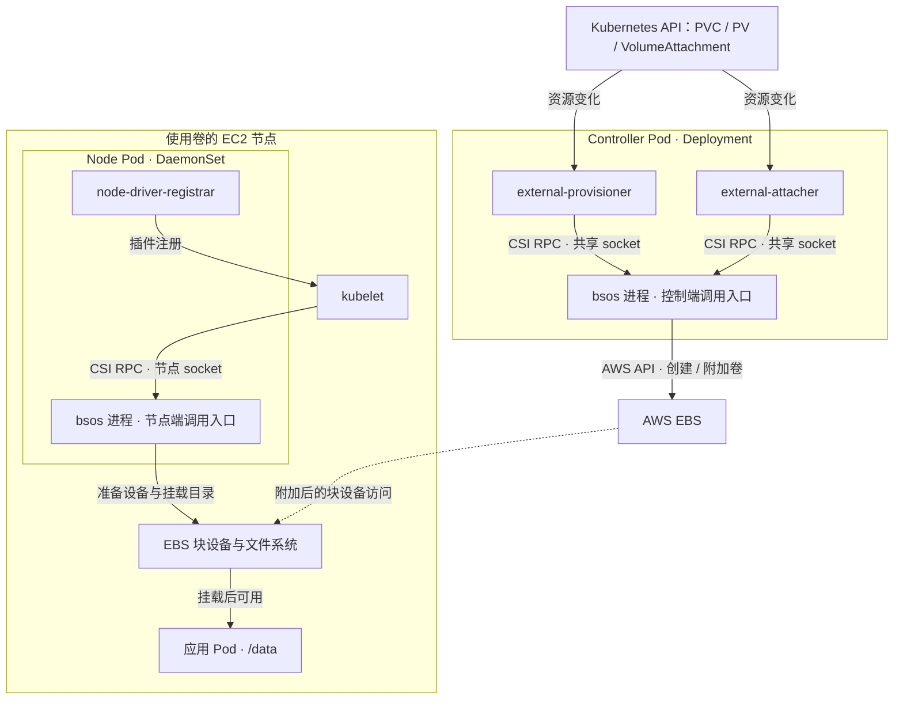

# CSI 简介与部署方式

- 代码仓库：https://github.com/normalzzz/bsos
- 信息来源：https://github.com/viveksinghggits

假设一个应用需要把文件保存在 `/data`，并希望 Pod 重建后还能读到这些文件。应用可以通过 PersistentVolumeClaim（PVC）申请持久化存储，再在 Pod 配置中引用这个 PVC。Kubernetes 根据配置安排创建存储、连接节点和挂载目录等操作。

`bsos` 是本仓库编写的 CSI Driver，也就是接收 Kubernetes 存储请求并执行这些操作的驱动程序。它使用 AWS EBS 保存数据：EBS 提供云上的块存储卷，EC2 实例是本例中运行 Kubernetes 节点的虚拟机。下文中的“后端卷”指实际创建的 EBS 卷。

阅读本文需要了解 Pod、Deployment 和 DaemonSet。仓库用于学习 CSI，创建、附加和挂载方向已有实现，完整的卸载和回收流程还没有完成。

## Pod 使用 EBS 卷

仓库中的示例申请一块 3 GiB 的 EBS 卷，挂载到容器的 `/data` 目录。

对应的配置分在三个文件中：

| 文件 | Kubernetes 资源 | 表达的需求 |
| --- | --- | --- |
| examples/storageclass.yaml | StorageClass | 使用 `bsos.normalzzz.csi.dev` 驱动供应存储 |
| examples/pvc.yaml | PVC | 申请 3 GiB、访问模式为 `ReadWriteOnce` 的存储 |
| examples/pod.yaml | Pod | 使用该 PVC，将文件系统挂载到 `/data` |

https://github.com/normalzzz/bsos/blob/main/examples/storageclass.yaml

https://github.com/normalzzz/bsos/blob/main/examples/pvc.yaml

https://github.com/normalzzz/bsos/blob/main/examples/pod.yaml

这三个配置分别回答不同的问题：StorageClass 指定“由哪个驱动提供存储”，PVC 表达“应用需要多少存储、怎样访问”，Pod 则指定“使用哪个 PVC，挂到容器里的哪里”。

PersistentVolume（PV）是 Kubernetes 对一个实际存储卷的记录。在本例中，驱动先通过 AWS API 创建 EBS 卷，external-provisioner 再创建 PV，把 EBS 卷 ID 写进去。PVC 与这个 PV 绑定后，应用的存储申请就对应到了一个确定的 EBS 卷。

“动态供应”指根据 PVC 自动创建后端卷和 PV。与它对应的做法是管理员提前准备卷和 PV，再让 PVC 绑定已有 PV。PV 记录的是卷的信息，文件内容保存在 EBS 卷中。参考 Persistent Volumes 官方说明：

https://kubernetes.io/docs/concepts/storage/persistent-volumes/

本仓库的 StorageClass 如下：

```yaml
apiVersion: storage.k8s.io/v1
kind: StorageClass
metadata:
  name: bsos
provisioner: bsos.normalzzz.csi.dev
volumeBindingMode: WaitForFirstConsumer
```

`provisioner` 指定驱动名称。`WaitForFirstConsumer` 表示等到有 Pod 使用这个 PVC 时，再结合 Pod 可以运行在哪些节点上，决定去哪里创建卷。只有 PVC、还没有使用它的 Pod 时，暂不创建卷是正常现象。

这样安排与 EBS 的可用区限制有关。AWS 的一个 Region（区域，例如 `us-east-1`）包含多个 Availability Zone（可用区）。EBS 卷只能附加到同一可用区中的 EC2 实例，所以创建卷和选择节点需要配合。StorageClass 官方说明：

https://kubernetes.io/docs/concepts/storage/storage-classes/#volume-binding-mode

卷从创建到可供应用读写，包含几种不同的操作：

| 操作 | 在 EBS 示例中做什么 | 完成后得到什么 |
| --- | --- | --- |
| 创建卷 | 在 AWS 中申请一块 EBS 卷 | 一个 EBS 卷 ID，此时还没有连接到使用它的节点 |
| 附加（attach） | 把卷连接到目标 EC2 实例 | 节点操作系统能够识别这个块设备 |
| 准备文件系统 | 探测设备；需要时在新卷上建立 ext4 等文件系统 | 能保存目录和文件的存储空间 |
| 挂载（mount） | 将文件系统接到节点目录，再提供到容器的 `/data` | 应用可以通过文件路径读写 |

卸载（unmount）移除的是目录与文件系统的挂载关系；解除附加（detach）断开的是卷与 EC2 实例的连接。删除 EBS 卷才会销毁后端存储，这几步不能混为同一个“删除”操作。

EBS 卷及其使用条件可参考 AWS 文档：

https://docs.aws.amazon.com/ebs/latest/userguide/ebs-volumes.html

## CSI

CSI 的全称是 Container Storage Interface，即容器存储接口。它规定了容器编排系统与存储插件之间的接口。存储提供方可以编写独立插件，将块存储或文件存储接入 Kubernetes，无需修改 Kubernetes 核心代码。其他采用 CSI 的容器编排系统也可以使用这套接口。Kubernetes CSI 简介：

https://kubernetes-csi.github.io/docs/introduction.html

CSI 文档中常见的术语如下：

| 术语 | 含义 | 本仓库中的对应对象 |
| --- | --- | --- |
| CO：Container Orchestration System | 容器编排系统 | Kubernetes |
| SP：Storage Provider | 提供 CSI 插件实现的存储提供方 | 本教程通过 `bsos` 实现对 AWS EBS 的接入 |
| CSI Driver / Plugin | 实现 CSI 接口的驱动程序 | `bsos` Go 程序 |
| Volume | 提供给工作负载使用的存储卷 | 创建出的 EBS 卷 |
| RPC：Remote Procedure Call | 调用服务端方法的机制 | `CreateVolume`、`NodePublishVolume` 等调用 |

一次 RPC 可以理解为调用另一个进程中的方法。例如调用方发出 `CreateVolume` 请求，驱动执行创建卷的代码，再返回结果。Protocol Buffers 定义请求和响应有哪些字段，gRPC 负责传输请求、调用对应方法并返回响应。

本例使用 Unix Domain Socket 让进程通信。它以文件路径作为通信地址，例如 `/csi/csi.sock`；调用方连接这个地址发送 RPC，卷里的文件数据不会写进这个 socket 文件。常见调用方包括 sidecar，以及每个节点上负责 Pod 运行的 kubelet。CSI 规范和部署说明：

https://github.com/container-storage-interface/spec/blob/v1.13.0/spec.md#solution-overview

https://kubernetes-csi.github.io/docs/deploying.html

例如，`CreateVolume` 请求包含容量、访问方式，以及卷允许在哪些位置被访问的要求。CSI 把区域、可用区等位置信息称为“拓扑”（topology）。本仓库只使用可用区这一项拓扑信息。`bsos` 根据请求调用 AWS API 创建 EBS 卷，返回卷 ID 和实际容量等结果。

调用过程如下：

```text
Kubernetes 侧调用方
    │
    │ CSI RPC：CreateVolume
    ▼
bsos CSI Driver
    │
    │ AWS API：EC2 CreateVolume
    ▼
AWS EBS
```

调用方与驱动之间使用 CSI 接口，驱动与存储后端之间使用后端接口。更换存储系统时，驱动需要调整后端操作，CSI 请求和响应可以保持一致。

## 三个 Service

CSI 将驱动的职责划分为三个 Service。这里指 gRPC 服务，与 Kubernetes 中 `kind: Service` 的网络资源是两个概念。

| CSI Service | 主要职责 | 代表性 RPC |
| --- | --- | --- |
| Identity Service | 提供驱动身份、版本、插件能力及就绪信息 | `GetPluginInfo`、`GetPluginCapabilities`、`Probe` |
| Controller Service | 管理存储资源及卷与节点的关系 | `CreateVolume`、`DeleteVolume`、`ControllerPublishVolume` |
| Node Service | 在工作负载所在节点上准备、发布和卸载卷 | `NodeGetInfo`、`NodeStageVolume`、`NodePublishVolume` |

Controller Service 调用 AWS API 管理卷，所以可以运行在能够访问 AWS API 的位置。Node Service 要操作使用卷的节点上的 `/dev` 设备和挂载目录，因此必须在该节点运行。

调用方会先查询驱动支持哪些功能，这叫“能力查询”。例如驱动声明支持创建卷，provisioner 才能按相应流程调用它。能力查询返回的是功能声明，具体操作仍要通过后续 RPC 执行。CSI Service 定义：

https://github.com/container-storage-interface/spec/blob/v1.13.0/spec.md#rpc-interface

Controller Plugin 和 Node Plugin 分别指控制端和节点端的驱动组件。一个进程可以提供多个 Service，三个 Service 可以合并实现，也可以分开实现。

## 部署方式

CSI 规范给出了四种部署示意，主要区别在于 Controller 的部署位置，以及 Controller 和 Node 是否合并到同一进程。没有集中控制端的部署方式称为 headless。在 Kubernetes 中，还需要配合 sidecar 和 kubelet 的调用方式安排组件。CSI 架构说明：

https://github.com/container-storage-interface/spec/blob/v1.13.0/spec.md#architecture

### 集中部署 Controller

```text
集群级 Controller 组件
    └── Controller Plugin

节点 A                         节点 B
    └── Node Plugin                └── Node Plugin
```

Controller 集中管理后端资源，Node 负责本机挂载。Kubernetes 中通常用 Deployment 或 StatefulSet 部署 Controller，用 DaemonSet 部署 Node。Controller Pod 可以运行在具备所需访问条件的节点上，不要求运行在控制平面节点。Kubernetes CSI 部署说明：

https://kubernetes-csi.github.io/docs/deploying.html

`bsos` 采用这种方式。Controller 通过 AWS API 创建和附加卷，Node 处理设备和目录。

### 在各节点分别部署 Controller 和 Node

```text
节点 A                         节点 B
    ├── Controller Plugin          ├── Controller Plugin
    └── Node Plugin                └── Node Plugin
```

每个节点都运行 Controller 和 Node，分别由不同进程提供服务。依赖本地资源的管理操作可以在资源所在节点执行，两类服务可以分别组织。

这种方式需要处理请求的节点选择，以及多个 Controller 实例的分工。将 Controller Deployment 改成 DaemonSet 后，仍需要安排这些行为。

### 在各节点合并部署 Controller 和 Node

```text
节点 A                         节点 B
    └── Unified Plugin             └── Unified Plugin
        ├── Controller Service         ├── Controller Service
        └── Node Service               └── Node Service
```

每个节点运行一个进程，在同一个 gRPC 服务地址上提供 Controller 和 Node Service。这样无需为两组接口分别运行驱动进程，但调用方仍需要知道哪个实例负责哪个节点的资源。

服务是否合并与部署位置是两个选择。集中部署 Controller 时，也可以使用同时提供多个 Service 的驱动进程。

### 仅部署 Node

```text
节点 A                         节点 B
    └── Node Plugin                └── Node Plugin
```

存储已经通过其他方式准备好、无需 Controller Service 时，可以只部署 Node。插件仍需提供 Identity Service，其能力声明中不包含 Controller Service。

如果需要通过 PVC 动态创建后端卷，还需要提供创建卷的实现。

## Kubernetes 中的组件

sidecar 是与驱动一起放在 Pod 中运行的辅助容器。Kubernetes 存储社区提供了处理存储资源、注册驱动等工作的 sidecar。例如 external-provisioner 发现 PVC 需要新卷，就调用驱动的 `CreateVolume`。

驱动因此主要实现 AWS API 操作和节点文件系统操作，观察 PVC、创建 PV 等 Kubernetes 资源处理由相应 sidecar 完成。不同 sidecar 分工不同，registrar 负责与 kubelet 注册，并不观察 PVC。CSI sidecar 说明：

https://kubernetes-csi.github.io/docs/sidecar-containers.html

本仓库使用了三个 sidecar：

| 组件 | 部署位置 | 在本例中的作用 |
| --- | --- | --- |
| external-provisioner，镜像名为 `csi-provisioner` | Controller Pod | 处理动态供应需求，调用 `CreateVolume` / `DeleteVolume` |
| external-attacher，镜像名为 `csi-attacher` | Controller Pod | 处理 `VolumeAttachment`，调用控制端发布 / 解除发布方法 |
| node-driver-registrar | Node Pod | 协助将驱动的节点端入口注册到本机 kubelet |

下面分别是 provisioner、attacher 和 registrar 的文档：

https://kubernetes-csi.github.io/docs/external-provisioner.html

https://kubernetes-csi.github.io/docs/external-attacher.html

https://github.com/kubernetes-csi/node-driver-registrar

控制端 sidecar 通过 Kubernetes API 观察资源，再通过共享 socket 调用驱动。节点上的 kubelet 通过节点端 socket 直接调用 Node Service，registrar 协助 kubelet 发现并注册这个入口。Kubernetes CSI 通信方式说明：

https://kubernetes-csi.github.io/docs/introduction.html#minimum-requirements-for-developing-and-deploying-a-csi-driver-for-kubernetes

CSI RPC 负责创建、附加和挂载卷。卷挂载好之后，应用在 `/data` 中读写文件，数据通过节点上的文件系统和块设备访问 EBS，不需要每次读写都调用 `NodePublishVolume`。

## bsos 的部署

仓库中的两份清单分别部署 Controller 和 Node：

- manifest/deployment.yaml 部署一个 Controller Pod，包含 `external-provisioner`、`external-attacher` 和 `bsos` 三个容器。
- manifest/node-plugin.yaml 通过 DaemonSet 部署 Node Pod，每个 Pod 包含 registrar 和驱动容器。

https://github.com/normalzzz/bsos/blob/main/manifest/deployment.yaml

https://github.com/normalzzz/bsos/blob/main/manifest/node-plugin.yaml

组件之间的调用关系如下：



两种 Pod 使用同一个驱动镜像。pkg/driver/Driver.go 中的 `Run()` 将三个 Service 注册到同一个 gRPC Server：

https://github.com/normalzzz/bsos/blob/main/pkg/driver/Driver.go

```go
drv.server = grpc.NewServer()

csi.RegisterNodeServer(drv.server, drv)
csi.RegisterControllerServer(drv.server, drv)
csi.RegisterIdentityServer(drv.server, drv)
```

Controller Pod 与 Node Pod 中的 `bsos` 使用相同的代码和镜像，每个进程都提供三个 Service。它们分别运行，监听各自的 socket。

| 位置 | 容器中的 CSI endpoint | 共享方式 | 主要调用方 |
| --- | --- | --- | --- |
| Controller Pod | `unix:///var/lib/csi/sockets/pluginproxy/bsoscsi.sock` | Pod 内的 `emptyDir` | provisioner、attacher |
| Node Pod | `unix:///csi/csi.sock` | 节点上的 `hostPath` | kubelet；registrar 也通过该入口查询驱动身份 |

Node Pod 内的 `/csi/csi.sock` 对应宿主机上的 `/var/lib/kubelet/plugins/bsos.normalzzz.csi.dev/csi.sock`。registrar 将宿主机上的路径告知 kubelet。插件注册还会使用另一条注册 socket。

驱动名称 `bsos.normalzzz.csi.dev` 定义在 `Driver.go` 的 `DefaultDriverName` 中，由 Identity Service 返回。StorageClass 的 `provisioner` 使用这个名称来选择驱动。

## 卷的生命周期

本例把节点挂载分成两步。“暂存”（Stage）是先将卷挂到节点上供该卷使用的公共目录；“发布”（Publish）是再把这个目录挂到某个 Pod 对应的目录。这里的“暂存”不表示文件内容存在内存中，数据仍保存在 EBS 上。

下表列出采用这种方式的完整生命周期，以及 EBS 驱动在每一步应做的事：

| 阶段 | 主要调用方 | CSI RPC | EBS 驱动在该阶段的操作 |
| --- | --- | --- | --- |
| 创建卷 | external-provisioner | `CreateVolume` | 创建 EBS 卷 |
| 附加到节点 | external-attacher | `ControllerPublishVolume` | 将卷附加到目标 EC2 实例 |
| 节点暂存 | kubelet | `NodeStageVolume` | 检查文件系统并挂载到节点暂存目录 |
| 发布给 Pod | kubelet | `NodePublishVolume` | 将暂存目录 bind mount 到 Pod 的卷目标目录 |
| 移除 Pod 的挂载 | kubelet | `NodeUnpublishVolume` | 卸载 Pod 对应的卷目标目录 |
| 取消节点暂存 | kubelet | `NodeUnstageVolume` | 在没有使用者时卸载暂存目录 |
| 解除节点附加 | external-attacher | `ControllerUnpublishVolume` | 将卷从 EC2 实例分离 |
| 删除后端卷 | external-provisioner | `DeleteVolume` | 按回收策略删除 EBS 卷 |

正常实现中，删除 Pod 会触发它对应的挂载清理；保留 PVC 时，后端卷通常仍用于保存数据。删除 PVC 后是否删除 EBS 卷，由 PV 的回收策略等条件决定。

当前仓库已经有创建、附加和挂载方向的代码，但 `NodeUnpublishVolume`、`NodeUnstageVolume`、`ControllerUnpublishVolume` 和 `DeleteVolume` 仍返回 `Unimplemented`，也就是方法尚未实现。因此不能把上表当作当前代码已经全部跑通的测试结果。PV 回收策略说明：

https://kubernetes.io/docs/concepts/storage/persistent-volumes/#reclaiming
