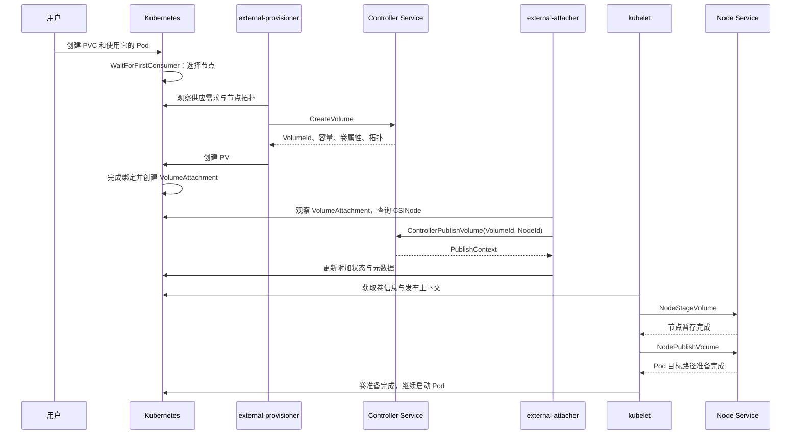

# CSI 的三个 Service 与卷生命周期

- 代码仓库：https://github.com/normalzzz/bsos
- 信息来源：https://github.com/viveksinghggits

一个 EBS 卷要交给 Pod 使用，通常要经过创建卷、附加到 EC2 实例、节点挂载这几个过程。CSI 把相关方法放在三个 Service 中：Identity 用于了解驱动本身，Controller 用于管理后端卷，Node 用于处理使用卷的节点上的操作。部署方式见《CSI 简介与部署方式》。

https://github.com/normalzzz/bsos/blob/main/doc/doc1.md

下文先说明每组方法由谁调用、做什么，再用同一个卷串起整个过程。方法名中的 Publish 表示“让某个对象能够使用卷”：`ControllerPublishVolume` 面向节点，在 EBS 中对应附加；`NodePublishVolume` 面向工作负载，在本例中对应为 Pod 准备挂载路径。

文中的请求是调用方发给驱动的参数，响应是驱动返回的结果。例如 `CreateVolumeRequest` 表示创建卷请求，`CreateVolumeResponse` 表示创建结果。后面会使用 Go 字段名，如 `VolumeId`，来对应仓库代码。

## Service 与调用方

CSI 的 Service 是一组 gRPC 方法。例如 Node Service 包含 `NodeGetInfo` 和 `NodeStageVolume` 等方法。它描述驱动提供的程序接口，Kubernetes 中 `kind: Service` 则是网络访问资源，两者名称相同但用途不同。

三个 Service 都由 `Driver` 实现，在 Driver.go 中注册到同一个 gRPC Server：

https://github.com/normalzzz/bsos/blob/main/pkg/driver/Driver.go

```go
drv.server = grpc.NewServer()

csi.RegisterNodeServer(drv.server, drv)
csi.RegisterControllerServer(drv.server, drv)
csi.RegisterIdentityServer(drv.server, drv)
```

Controller Pod 和 Node Pod 分别运行驱动进程，监听各自的 socket。每个进程都提供三个 Service，调用方如下：

| Service | 负责什么 | 本仓库中的主要调用方 | 实现文件 |
| --- | --- | --- | --- |
| Identity | 返回驱动身份、插件能力和就绪信息 | provisioner、attacher、registrar 等调用方 | IdentityServer.go |
| Controller | 创建、删除后端卷，管理卷与节点的附加关系 | external-provisioner、external-attacher | ControllerServer.go |
| Node | 返回节点身份，在节点上准备和挂载卷 | kubelet | NodeServer.go |

https://github.com/normalzzz/bsos/blob/main/pkg/driver/IdentityServer.go

https://github.com/normalzzz/bsos/blob/main/pkg/driver/ControllerServer.go

https://github.com/normalzzz/bsos/blob/main/pkg/driver/NodeServer.go

external-provisioner 和 external-attacher 观察 Kubernetes API 对象，再调用驱动。kubelet 通过节点端 socket 直接调用 Node Service。node-driver-registrar 协助将驱动入口注册到 kubelet，挂载工作由 kubelet 发起。这三个组件的文档分别如下：

https://kubernetes-csi.github.io/docs/external-provisioner.html

https://kubernetes-csi.github.io/docs/external-attacher.html

https://github.com/kubernetes-csi/node-driver-registrar

## Identity Service

调用方连接驱动后，需要知道“连接的是哪个驱动”“它提供哪些功能”“是否准备好接收操作”。Identity Service 的三个 RPC 分别提供这些信息：

| RPC | 返回的信息 | 本仓库的行为 |
| --- | --- | --- |
| `GetPluginInfo` | 驱动名称和厂商版本 | 名称为 `bsos.normalzzz.csi.dev`，版本为 `v1.1` |
| `GetPluginCapabilities` | 插件级能力 | 声明提供 Controller Service，并支持卷访问拓扑约束 |
| `Probe` | 健康与初始化状态 | 固定返回 `Ready=true` |

### GetPluginInfo

`GetPluginInfo` 返回驱动名称，与 StorageClass 中的 `provisioner` 一致：

```text
GetPluginInfoResponse.name       = bsos.normalzzz.csi.dev
StorageClass.provisioner         = bsos.normalzzz.csi.dev
```

`VendorVersion` 表示驱动版本，当前代码返回 `v1.1`。CSI Go 包的依赖版本记录在 go.mod 中，两者含义不同。

https://github.com/normalzzz/bsos/blob/main/go.mod

### GetPluginCapabilities

“插件级能力”说明这个驱动总体提供哪些功能。它不执行存储操作，也不表示账号有哪些访问权限。本仓库返回两个标记：

- `CONTROLLER_SERVICE`：插件提供 Controller Service。
- `VOLUME_ACCESSIBILITY_CONSTRAINTS`：卷只有在某些位置才能访问，调用方需要结合卷和节点的位置创建卷、安排 Pod。

这里的位置在 CSI 中称为“拓扑”。本例用可用区表达位置：一个 EBS 卷只能附加到同一可用区的 EC2 实例。`NodeGetInfo` 报告节点在哪个可用区；创建卷请求说明允许选择哪些可用区；`CreateVolume` 响应说明实际创建出的卷在哪些节点上可用。

### Probe

`Probe` 检查驱动的健康和初始化状态。驱动健康但仍在初始化时，可以成功返回 `Ready=false`；初始化完成后返回 `Ready=true`。不健康时返回相应的 gRPC 错误。Identity RPC 说明：

https://github.com/container-storage-interface/spec/blob/v1.13.0/spec.md#identity-service-rpc

当前代码固定返回就绪：

```go
return &csi.ProbeResponse{Ready: wrapperspb.Bool(true)}, nil
```

这里没有检查 AWS API 连通性或挂载工具。创建卷和挂载的结果需要看相应操作是否成功。

## Controller Service

Controller Service 管理 EBS 卷及其与 EC2 实例的附加关系。例如“创建 3 GiB 的卷”和“把这个卷附加到某个实例”都在这组接口中完成。`bsos` 收到 CSI 请求后，会调用 AWS EC2 API 执行对应操作。

表中的 `Unimplemented` 是 gRPC 错误码，表示当前方法没有完成实现。能力声明和方法实现需要对应，不能仅根据方法名称或声明判断功能已经可用。

| RPC | 职责 | 本仓库当前状态 |
| --- | --- | --- |
| `CreateVolume` | 创建后端卷，返回卷 ID、容量和卷属性 | 已有调用 AWS API 创建 gp3 卷的实现 |
| `DeleteVolume` | 删除后端卷 | 返回 `Unimplemented` |
| `ControllerPublishVolume` | 使卷可供指定节点访问 | 已有附加到 EC2 并等待 attachment 完成的实现 |
| `ControllerUnpublishVolume` | 解除卷与节点的发布关系 | 返回 `Unimplemented` |
| `ControllerGetCapabilities` | 返回控制端支持的操作 | 声明创建 / 删除、发布 / 解除发布两组能力 |
| `ValidateVolumeCapabilities` | 查询已有卷是否支持请求的访问方式 | 返回 `Unimplemented` |

### CreateVolume

external-provisioner 根据 PVC 自动申请新卷，这个过程称为动态供应。它把 PVC 的容量、访问方式等要求组织成 `CreateVolume` 请求。例如示例 PVC 申请 3 GiB、允许单节点读写的文件系统卷，请求就需要表达这些条件，并携带可用区要求。

代码校验请求，将 bytes 换算为 GiB，读取可用区，再调用 AWS API。成功后返回以下字段：

| 字段 | 当前代码返回的内容 | 后续用途 |
| --- | --- | --- |
| `VolumeId` | AWS 返回的 EBS 卷 ID | 作为后续附加、挂载和删除请求的卷标识 |
| `CapacityBytes` | 实际分配容量，以 bytes 表示 | 描述卷容量 |
| `VolumeContext` | 一个字符串键值表，当前包含 `availabilityZone` | 保存到 PV，供后续请求传回驱动 |
| `AccessibleTopology` | `topology.kubernetes.io/zone` 对应的可用区 | 描述卷可以在哪些拓扑范围内访问 |

驱动的 `CreateVolume` 创建 EBS 卷后，external-provisioner 根据响应创建对应的 PV。后续请求中的卷 ID 对应 PV 的 `spec.csi.volumeHandle`。动态供应说明：

https://kubernetes-csi.github.io/docs/external-provisioner.html

### ControllerPublishVolume

`ControllerPublishVolume` 使卷可供指定节点访问，在本例中对应 EBS AttachVolume 操作。

请求通过卷 ID 和节点 ID 指定附加对象：

```text
VolumeId → EBS 卷 ID
NodeId   → 目标 EC2 实例 ID
```

代码先查询目标实例已经使用的设备名，给本次附加选择一个名称，例如 `/dev/sdf`。必要时调用 `AttachVolume`，并等待 AWS 报告该卷在目标实例上的附加状态为 attached。响应中的 `PublishContext` 是一个字符串键值表，当前用它传递选中的设备名。

`ControllerPublishVolume` 完成附加后，Node Service 再处理设备和文件系统挂载。

external-attacher 观察 `VolumeAttachment` 并更新附加状态。这个 Kubernetes 资源记录 PV 与目标节点的关系，EBS 卷本身仍由 AWS 管理。attacher 工作方式说明：

https://kubernetes-csi.github.io/docs/external-attacher.html

## Node Service

Node Service 运行在使用卷的节点上，返回节点信息，并准备文件系统和 Pod 的挂载目录。

| RPC | 职责 | 本仓库当前状态 |
| --- | --- | --- |
| `NodeGetInfo` | 返回驱动使用的节点 ID、卷数量限制和节点拓扑 | 从 Kubernetes Node 读取实例 ID 与可用区 |
| `NodeGetCapabilities` | 返回节点端能力 | 声明 `STAGE_UNSTAGE_VOLUME` |
| `NodeStageVolume` | 在节点上暂存卷 | 已有设备探测、文件系统准备和挂载实现 |
| `NodePublishVolume` | 将卷发布到工作负载的目标路径 | 已有从暂存目录 bind mount 的实现 |
| `NodeUnpublishVolume` | 移除工作负载对应的卷挂载 | 返回 `Unimplemented` |
| `NodeUnstageVolume` | 移除节点上的暂存挂载 | 返回 `Unimplemented` |

### NodeGetInfo

代码从 Kubernetes Node 的 `spec.providerID` 提取 EC2 实例 ID，作为 `NodeId` 返回。可用区来自节点标签 `topology.kubernetes.io/zone`。

两种节点标识的用途如下：

| 标识 | 描述哪个对象 | 本例用途 |
| --- | --- | --- |
| Kubernetes Node 名称 | Kubernetes 中的节点资源 | 查找 Node 对象；作为 `VolumeAttachment.spec.nodeName` |
| CSI `NodeId` | 存储后端能够识别的节点 | 本例为 EC2 实例 ID，传给 `ControllerPublishVolume` |

节点注册后，kubelet 将驱动名称、节点 ID 和拓扑键等信息记录到 CSINode。external-attacher 可以据此从 Kubernetes Node 名称找到对应的 CSI 节点 ID。CSINode 说明：

https://kubernetes-csi.github.io/docs/csi-node-object.html

`MaxVolumesPerNode` 表示控制端最多可向该节点发布多少个卷，在本例中可理解为附加数量上限。返回 0 表示驱动没有提供这一上限，交给 Kubernetes 决定如何处理；它不表示 EC2 可以无限附加卷。NodeGetInfo 字段说明：

https://github.com/container-storage-interface/spec/blob/v1.13.0/spec.md#nodegetinfo

### NodeStageVolume

`NodeStageVolume` 收到附加结果后，从 `PublishContext` 中取出设备名。文件系统卷需要先确认设备存在，再检查是否已有文件系统，必要时准备文件系统，最后挂到节点上的一个目录。

这个目录由 kubelet 通过 `StagingTargetPath` 指定，称为暂存目录。它是该卷在节点上的公共挂载位置，还不是应用容器的 `/data`。当前代码已包含这段流程，但新设备格式化后的类型设置等问题仍需修正，详见 doc7。

### NodePublishVolume

暂存完成后，`NodePublishVolume` 把暂存目录 bind mount 到 Pod 对应的 `TargetPath`。bind mount 的作用是让同一份文件系统内容能从另一个路径访问，不复制文件。本仓库还会根据请求添加只读挂载选项。

```text
EBS 块设备
    │ NodeStageVolume
    ▼
节点暂存目录（StagingTargetPath）
    │ NodePublishVolume
    ▼
Pod 对应的节点卷目录（TargetPath）
    │ 提供给容器使用
    ▼
容器内的 /data
```

`TargetPath` 是节点侧的目标路径，由 kubelet 传入。容器中的 `/data` 由 Pod 的 `volumeMounts.mountPath` 指定。

声明 `STAGE_UNSTAGE_VOLUME` 的驱动需要处理 Stage 和 Publish 两个阶段。未声明这项能力时，由 `NodePublishVolume` 直接完成节点发布。Node Service 说明：

https://github.com/container-storage-interface/spec/blob/v1.13.0/spec.md#node-service-rpc

## 能力声明

能力查询是在执行操作之前询问驱动支持哪些功能。三个查询分别覆盖插件整体、控制端和节点端：

| 方法 | 查询范围 | 当前仓库声明的能力 |
| --- | --- | --- |
| `GetPluginCapabilities` | 插件整体提供哪些服务或特性 | `CONTROLLER_SERVICE`、`VOLUME_ACCESSIBILITY_CONSTRAINTS` |
| `ControllerGetCapabilities` | 控制端支持哪些操作 | `CREATE_DELETE_VOLUME`、`PUBLISH_UNPUBLISH_VOLUME` |
| `NodeGetCapabilities` | 节点端支持哪些操作 | `STAGE_UNSTAGE_VOLUME` |

以下节选来自 ControllerServer.go，循环体将列表中的能力写入响应：

https://github.com/normalzzz/bsos/blob/main/pkg/driver/ControllerServer.go

```go
for _, c := range []csi.ControllerServiceCapability_RPC_Type{
    csi.ControllerServiceCapability_RPC_CREATE_DELETE_VOLUME,
    csi.ControllerServiceCapability_RPC_PUBLISH_UNPUBLISH_VOLUME,
} {
```

`CONTROLLER_SERVICE` 表示插件提供 Controller Service。创建卷需要控制端声明 `CREATE_DELETE_VOLUME`，控制端发布步骤与 `PUBLISH_UNPUBLISH_VOLUME` 有关。

这些能力对应成对操作。创建和删除、Stage 和 Unstage 都需要实现。仓库已声明这些能力，但部分回收方法仍返回 `Unimplemented`，需要补齐。

操作请求中的 `VolumeCapability` 则描述“这一个卷准备怎样使用”，例如按文件系统目录使用，还是把原始块设备直接交给应用，以及允许哪些节点读写。

例如，`NodeGetCapabilities` 返回的 `STAGE_UNSTAGE_VOLUME` 告诉 kubelet 需要调用 Stage；`NodeStageVolumeRequest.VolumeCapability` 则告诉驱动这次要准备什么类型的卷。前者决定调用流程，后者描述这次操作的要求。

## 卷的生命周期

Identity 查询、节点注册和能力查询完成后，EBS 文件系统卷的创建和挂载过程如下：



PVC 处于 Bound 状态时，卷的绑定已经完成。`VolumeAttachment.status.attached=true` 表示附加状态已更新。节点挂载完成后，应用才能通过文件路径使用卷。

### 创建卷的结果怎样传到挂载请求

Controller Pod 和 Node Pod 是分开的进程。Controller 创建卷后，Node 不会自动知道新卷的 ID；Controller 附加卷后，Node 也不会自动得到它返回的设备名。Kubernetes 组件需要把前一步的结果保存下来，再放进下一步请求。

下面用同一个 EBS 卷说明这个过程。`vol-example`、`i-example` 和节点名 `worker-a` 都是示意值，`/dev/sdf` 也只是示例设备名。

#### 创建结果写入 PV

假设 `CreateVolume` 创建了卷 `vol-example`，返回的主要内容如下。这里用简化表示法说明 Go 字段，不是完整响应或实测输出：

```text
CreateVolumeResponse.Volume
  VolumeId: vol-example
  VolumeContext:
    availabilityZone: us-east-1c
```

`VolumeContext` 在 Go 中是 `map[string]string`，也就是字符串键值表。它保存驱动希望后续操作带回来的卷属性。本例的 `availabilityZone` 由驱动自己定义，值表示可用区；这里的 Context 不指 Go 的 `context.Context`，也不保存应用写入卷的文件。

external-provisioner 收到响应后创建 PV，把卷 ID 和这个键值表存进去：

```yaml
spec:
  csi:
    driver: bsos.normalzzz.csi.dev
    volumeHandle: vol-example
    volumeAttributes:
      availabilityZone: us-east-1c
```

因此，后续组件读取这个 PV，就能知道要操作哪个 EBS 卷，并在 CSI 请求的 `VolumeContext` 中带回这些属性。当前节点挂载代码没有使用 `availabilityZone`，不能把“字段会传递”理解为每个方法都会读取它。

创建响应还包含 `AccessibleTopology`。provisioner 根据它生成 PV 的节点亲和性，也就是“这个卷允许在哪些节点使用”的约束。调度使用的是这项约束，不会把 `volumeAttributes` 中任意一个叫 `availabilityZone` 的字段自动当作调度规则。

#### 附加时从 CSINode 查找实例 ID

Pod 被安排到 `worker-a` 后，附加请求需要同时指定卷和目标节点。external-attacher 从 PV 读取 `volumeHandle`，从 `worker-a` 对应的 CSINode 驱动条目读取 `nodeID`，再构造请求：

```text
ControllerPublishVolumeRequest
  VolumeId: vol-example
  NodeId: i-example
  VolumeContext:
    availabilityZone: us-east-1c
```

这里的 `NodeId` 告诉 AWS 要把卷附加到哪台 EC2 实例。它来自节点注册时的 `NodeGetInfo`，不是创建卷时生成的值。

#### 附加结果写入 VolumeAttachment

假设 Controller 选中 `/dev/sdf`，完成附加后返回：

```text
ControllerPublishVolumeResponse
  PublishContext:
    devicePath: /dev/sdf
```

`PublishContext` 也是字符串键值表，但它描述的是“这次把卷交给指定节点使用后，节点还需要什么信息”。本例把设备名放在里面，键 `devicePath` 由 `bsos` 自己定义。

external-attacher 将这个表写入 VolumeAttachment，结果片段如下：

```yaml
status:
  attached: true
  attachmentMetadata:
    devicePath: /dev/sdf
```

#### kubelet 构造节点挂载请求

接着，`worker-a` 上的 kubelet 从 PV 读取卷 ID 和属性，从 VolumeAttachment 读取附加结果，构造 `NodeStageVolume` 请求：

```text
NodeStageVolumeRequest
  VolumeId: vol-example
  VolumeContext:
    availabilityZone: us-east-1c
  PublishContext:
    devicePath: /dev/sdf
  StagingTargetPath: kubelet 为这个卷准备的节点暂存路径
```

这些只是说明信息传递的相关字段，请求还会包含卷访问能力等参数。节点端已经通过本机 socket 收到调用，因此这个请求不需要再用 `NodeId` 选择另一台节点。

代码中负责传递设备名的两处就在这里。Controller 构造响应：

```go
// ControllerPublishVolume 中构造响应。
pvInfo := map[string]string{DevicePathKey: device}
return &csi.ControllerPublishVolumeResponse{PublishContext: pvInfo}, nil
```

节点端读取 kubelet 传来的请求：

```go
// NodeStageVolume 中读取请求。
sourcepath := r.GetPublishContext()[DevicePathKey]
```

`DevicePathKey` 在 Driver.go 中定义为 `devicePath`，所以最后这行代码在示例中取到的就是 `/dev/sdf`。这中间是“Controller 响应 → attacher 保存 → kubelet 读取并发送 → Node 读取请求”的传递过程，Controller 没有直接调用 Node 方法。这个设备名是否对应节点实际设备，还要处理 doc6 中说明的设备命名差异。

https://github.com/normalzzz/bsos/blob/main/pkg/driver/Driver.go

Stage 完成后，kubelet 再调用 `NodePublishVolume`，传入相同的暂存路径，并增加该 Pod 对应的 `TargetPath`。这两个路径都由 kubelet 安排，驱动按请求把文件系统挂到相应位置；应用容器中的 `/data` 是再往后提供给容器使用的路径。

这些字段可以按用途区分：

| 字段 | 回答的问题 | 本例中的值来自哪里 |
| --- | --- | --- |
| `VolumeId` | 操作哪个卷？ | AWS 创建卷后返回的卷 ID，保存在 PV 中 |
| `NodeId` | 附加到哪台实例？ | NodeGetInfo 返回的实例 ID，保存在 CSINode 中 |
| `VolumeContext` | 这个卷有哪些驱动自定义属性？ | CreateVolume 返回的键值表，保存在 PV 中 |
| `PublishContext` | 本次附加后，节点要用到什么信息？ | ControllerPublishVolume 返回的键值表，保存在 VolumeAttachment 中 |
| `StagingTargetPath` / `TargetPath` | 在节点上挂到哪里？ | kubelet 根据卷和 Pod 安排的路径 |

这两个 Context 字段不应存放凭据。需要传递凭据的 CSI 操作有专门的 `Secrets` 字段；本仓库部分方法打印请求前会先移除日志副本中的 Secrets。CSI 字段定义和 Kubernetes 中的传递实现：

https://github.com/container-storage-interface/spec/blob/v1.13.0/spec.md#controllerpublishvolume

https://github.com/kubernetes-csi/external-attacher/blob/master/pkg/controller/csi_handler.go

https://github.com/kubernetes/kubernetes/blob/master/pkg/volume/csi/csi_attacher.go

https://github.com/kubernetes/kubernetes/blob/master/pkg/volume/csi/csi_mounter.go

### 回收

采用两阶段挂载时，正常清理流程需要分别处理 Pod 目录、节点公共挂载、EC2 附加关系和 EBS 卷。下图说明应有的顺序；当前仓库中的四个清理方法仍未实现：

```text
NodeUnpublishVolume       移除 Pod 对应的挂载
    ↓ 节点上不再有使用者
NodeUnstageVolume         移除节点暂存挂载
    ↓ 满足解除附加条件
ControllerUnpublishVolume 将卷从 EC2 实例分离
    ↓ 满足后端卷回收条件
DeleteVolume              删除 EBS 卷
```

回收操作可能分多次完成，失败时也可能重试。删除 Pod 时释放它的挂载；如果卷仍有其他使用者，就保留节点暂存和附加关系。

删除 PVC 后，按 PV 的回收策略处理后端卷。`Retain` 保留资源供后续处理，`Delete` 在满足回收条件时删除后端资源。PV 回收策略说明：

https://kubernetes.io/docs/concepts/storage/persistent-volumes/#reclaiming
