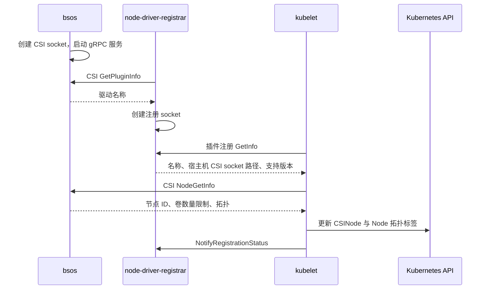

# 节点插件注册与 CSINode

- 代码仓库：https://github.com/normalzzz/bsos
- 信息来源：https://github.com/viveksinghggits
- 参考项目：https://github.com/viveksinghggits/bsos
- 来源与许可说明：https://github.com/normalzzz/bsos/blob/main/NOTICE.md

上一篇《Go CSI Driver 的启动与能力发现》介绍了 gRPC 服务的启动。Controller Pod 中的 sidecar 通过共享 socket 调用驱动；节点端还需要把驱动名称和 socket 地址告诉 kubelet，让它能调用 Node Service。

https://github.com/normalzzz/bsos/blob/main/doc/doc3.md

每个节点上的 kubelet 都需要知道：这个节点有没有 `bsos`，以及应该连接哪个 socket。`csi-node-driver-registrar` 负责提供注册服务，让 kubelet 取得驱动名称和通信地址。之后 kubelet 直接调用驱动的 `NodeGetInfo`，取得 EC2 实例 ID、可用区等信息，并保存到相关 Kubernetes 对象中。

这几步分别解决不同的问题。Go 中注册 Service 后，进程能处理 RPC；向 kubelet 注册插件后，kubelet 能找到本机驱动；CSINode 中出现驱动条目后，集群里的其他组件也能查到这个节点的驱动信息。

## 节点 Pod

节点端的部署清单是 manifest/node-plugin.yaml，使用 DaemonSet，在符合调度条件的各个节点上分别运行插件 Pod。这样 kubelet 调用的就是本机插件，插件执行挂载时操作的也是本机设备和目录。

https://github.com/normalzzz/bsos/blob/main/manifest/node-plugin.yaml

一个 Pod 中有两个容器：

| 容器名称 | 运行内容 |
| --- | --- |
| `node-plugin` | `bsos` 驱动，提供 CSI gRPC 服务 |
| `csi-driver-registrar` | 注册 sidecar，把驱动的 socket 地址提供给 kubelet |

Controller Pod 与节点 Pod 使用同一个驱动程序，分别监听自己的 socket。节点 Pod 通过 hostPath 把 socket 暴露给宿主机上的 kubelet，Controller Pod 的 socket 则供 Pod 内的 sidecar 使用。

当前清单中的节点驱动启动配置如下：

```yaml
args:
  - "--endpoint=$(CSI_ENDPOINT)"
env:
  - name: CSI_ENDPOINT
    value: unix:///csi/csi.sock
  - name: NODEID
    valueFrom:
      fieldRef:
        fieldPath: spec.nodeName
```

`NODEID` 取 Pod 所在的 Kubernetes Node 名称。程序用这个名称读取 Node 对象；`NodeGetInfo` 返回给 kubelet 的节点 ID 则来自 Node 的 `spec.providerID`。

## 两条 socket

注册时要解决两个问题：kubelet 从哪里发现新插件，以及发现后去哪里调用 CSI 方法。因此清单准备了两条 socket。

注册 socket 由 registrar 创建，放在 kubelet 已知的 `plugins_registry` 目录。kubelet 从它取得驱动的 CSI socket 地址，再连接由 `bsos` 创建的 CSI socket，调用 `NodeGetInfo`、`NodeStageVolume` 等方法。正常挂载请求直接发给驱动，不经过 registrar 转发。

| socket | 创建者 | 容器内路径 | 宿主机路径 | 用途 |
| --- | --- | --- | --- | --- |
| CSI socket | `bsos` | `/csi/csi.sock` | `/var/lib/kubelet/plugins/bsos.normalzzz.csi.dev/csi.sock` | registrar 查询驱动名称，kubelet 调用 CSI 接口 |
| 注册 socket | registrar | `/registration/bsos.normalzzz.csi.dev-reg.sock` | `/var/lib/kubelet/plugins_registry/bsos.normalzzz.csi.dev-reg.sock` | kubelet 发现插件并读取注册信息 |

清单通过两个 hostPath 提供这些目录：

```yaml
volumes:
  - name: registration-dir
    hostPath:
      path: /var/lib/kubelet/plugins_registry/
      type: DirectoryOrCreate
  - name: plugin-dir
    hostPath:
      path: /var/lib/kubelet/plugins/bsos.normalzzz.csi.dev/
      type: DirectoryOrCreate
```

`hostPath.path` 指宿主机目录，`mountPath` 指容器里看到这个目录的位置。两个容器都把同一个 `plugin-dir` 挂到 `/csi`，因此容器内的 `/csi/csi.sock` 与宿主机的 `/var/lib/kubelet/plugins/bsos.normalzzz.csi.dev/csi.sock` 是同一条 socket 的不同路径。

registrar 在容器内使用前一个路径，kubelet 在宿主机上使用后一个路径。排查时要看“哪个进程正在使用这个地址”，不能直接把容器路径填给宿主机上的 kubelet。

registrar 还把 `registration-dir` 挂到 `/registration`，在里面创建注册 socket。kubelet 监听宿主机的 `plugins_registry` 目录，发现新增的注册 socket 后发起注册。

registrar 的参数和挂载如下：

```yaml
args:
  - "--csi-address=/csi/csi.sock"
  - "--kubelet-registration-path=/var/lib/kubelet/plugins/bsos.normalzzz.csi.dev/csi.sock"
volumeMounts:
  - name: plugin-dir
    mountPath: /csi
  - name: registration-dir
    mountPath: /registration
```

`--csi-address` 是 registrar 容器内的 CSI socket 路径。`--kubelet-registration-path` 是提供给 kubelet 的宿主机 CSI socket 路径，不能填成注册 socket 的路径。这两个参数的区别见 node-driver-registrar 文档。

https://github.com/kubernetes-csi/node-driver-registrar#required-arguments

清单使用默认的 kubelet 根目录 `/var/lib/kubelet`。如果 kubelet 设置了其他 `--root-dir`，相关 hostPath 和 `--kubelet-registration-path` 也要改成节点实际使用的路径。

## 注册时的调用

registrar 先连接 CSI socket，调用 Identity Service 的 `GetPluginInfo`，取得驱动名称 `bsos.normalzzz.csi.dev`，再启动注册服务。



这里的 `GetInfo` 属于 kubelet 插件注册协议，`GetPluginInfo` 属于 CSI Identity Service。kubelet 通过注册 socket 访问 registrar，取得地址后，再通过 CSI socket 访问驱动。注册协议见 kubelet Plugin Watcher 文档。

https://github.com/kubernetes/kubernetes/blob/master/pkg/kubelet/pluginmanager/pluginwatcher/README.md

kubelet 调用 `NodeGetInfo` 后，用返回结果记录节点上的驱动信息。RPC 或信息写入失败，都会导致本次注册报错。对应处理见 kubelet CSI 插件代码。

https://github.com/kubernetes/kubernetes/blob/master/pkg/volume/csi/csi_plugin.go

## NodeGetInfo 的实现

`NodeGetInfo` 在 pkg/driver/NodeServer.go 中。它使用的是驱动启动时保存的 Node 对象。

https://github.com/normalzzz/bsos/blob/main/pkg/driver/NodeServer.go

pkg/driver/Driver.go 中的 `NewDriver` 先读取当前节点：

https://github.com/normalzzz/bsos/blob/main/pkg/driver/Driver.go

```go
node, err := input.Clientset.CoreV1().Nodes().Get(context.TODO(), input.NodeName, metav1.GetOptions{})
if err != nil {
    input.Logger.WithError(err).Fatalln("failed to get node info")
}
```

读取成功后，构造函数把 `*node` 保存到 `drv.selfnode`。`NodeGetInfo` 从它的 `spec.providerID` 中取出 EC2 实例 ID：

```go
parts := strings.Split(drv.selfnode.Spec.ProviderID, "/")
instanceID := parts[len(parts)-1]
if !strings.HasPrefix(instanceID, "i-") || len(instanceID) <= 2 {
    return nil, status.Error(codes.Internal, "Node ProviderID does not contain an EC2 instance ID")
}
```

AWS 节点的 ProviderID 通常类似 `aws:///us-east-1c/i-0123456789abcdef0`。代码按 `/` 拆分，取最后一段作为实例 ID。这里检查了 `i-` 前缀和长度，没有查询 EC2 来验证实例是否存在。

返回值包含节点 ID、卷数量限制和拓扑：

```go
return &csi.NodeGetInfoResponse{
    NodeId: instanceID,
    MaxVolumesPerNode: 0,
    AccessibleTopology: &csi.Topology{
        Segments: map[string]string{
            "topology.kubernetes.io/zone": drv.selfnode.Labels["topology.kubernetes.io/zone"],
        },
    },
}, nil
```

`NodeId` 是存储系统识别节点的 ID，在这个 EBS 驱动中就是 EC2 实例 ID。例如 Kubernetes Node 叫 `worker-a`，对应的 EC2 实例 ID 是 `i-0123456789abcdef0`，这次响应就返回后者。后续调用 AWS AttachVolume 时，AWS 才知道要把卷连接到哪台实例。

`MaxVolumesPerNode` 指控制端可以向这个节点发布的卷数量上限，在这里对应附加数量。返回 0 表示驱动没有给出上限，由 Kubernetes 决定如何处理；EC2 自身的附加限制仍然存在。字段含义见 CSI NodeGetInfo 规范。

https://github.com/container-storage-interface/spec/blob/v1.13.0/spec.md#nodegetinfo

`AccessibleTopology` 返回节点的位置。当前返回的 Segments 是键值表：键为 `topology.kubernetes.io/zone`，值从 Node 的同名标签中读取，例如 `us-east-1c`。这表示节点位于这个可用区。

当前代码没有检查标签值是否为空，所以部署前必须确认 Node 已有正确的 ProviderID 和可用区标签。缺少 ProviderID 会影响实例 ID 的提取，缺少可用区则会让后续创建卷拿不到正确的位置要求。

当前代码每次 RPC 都使用启动时缓存的 Node 对象。启动后修改了 ProviderID 或可用区标签，需要重启对应的驱动 Pod 才会重新读取。函数中的 EC2 元数据服务调用已被注释，不参与当前流程。

## CSINode 中记录什么

`CSINode` 记录一个 Kubernetes 节点上已注册的 CSI 驱动。它的名称与 Node 名称一致，属于集群级资源，也就是不隶属于某个 namespace；因此查询它不需要加 `-n kube-system`。

一个节点有多个驱动时，`spec.drivers` 中会有多个条目。kubelet 维护这些条目，Controller Pod 中的 attacher 则可以读取它们，将 Kubernetes 节点名称换成存储系统所需的节点 ID。CSINode 文档：

https://kubernetes-csi.github.io/docs/csi-node-object.html

下面是 `bsos` 对应条目的结构示例，节点名称和实例 ID 需要以实际集群为准：

```yaml
apiVersion: storage.k8s.io/v1
kind: CSINode
metadata:
  name: your-kubernetes-node-name
spec:
  drivers:
    - name: bsos.normalzzz.csi.dev
      nodeID: i-0123456789abcdef0
      topologyKeys:
        - topology.kubernetes.io/zone
```

`metadata.name` 是 Kubernetes Node 名称，`spec.drivers[].nodeID` 是这个驱动返回的 EC2 实例 ID。这条记录把两种节点标识关联起来，供后续附加卷时使用。

`topologyKeys` 只记录键名 `topology.kubernetes.io/zone`，说明这个驱动用哪个 Node 标签表示位置。实际值，例如 `us-east-1c`，保存在 Node 的同名标签中。provisioner 把键和值合起来，才能得到节点的可用区。

下面查询的是同一个节点的 CSINode、可用区标签和 ProviderID。先把变量中的占位名称换成实际 Node 名称：

```bash
node_name=your-kubernetes-node-name
kubectl get csinode "$node_name" -o yaml
kubectl get node "$node_name" -L topology.kubernetes.io/zone
kubectl get node "$node_name" -o jsonpath='{.spec.providerID}{"\n"}'
```

EBS 卷需要在合适的可用区创建。驱动的 Identity Service 已声明 `VOLUME_ACCESSIBILITY_CONSTRAINTS`，节点通过 `NodeGetInfo` 提供拓扑信息，创建卷时再通过 `CreateVolume` 的 `AccessibilityRequirements` 使用这些信息。相关机制见 CSI 拓扑说明。

https://kubernetes-csi.github.io/docs/topology.html

查看注册结果时，要在 `spec.drivers` 中找到 `bsos.normalzzz.csi.dev`。节点上已有其他 CSI 驱动时，`CSINode` 对象可能早就存在，不能只看对象是否存在。

## 节点端的权限和挂载

节点 Pod 使用 `csi-node-plugin` ServiceAccount，定义在 manifest/rbac-node.yaml 中。当前 ClusterRole 的有效规则是：

https://github.com/normalzzz/bsos/blob/main/manifest/rbac-node.yaml

```yaml
rules:
  - apiGroups: [""]
    resources: ["nodes"]
    verbs: ["get"]
```

这条权限供 `bsos` 在启动时读取 Node 对象。Node 是集群级资源，因此清单使用 ClusterRole 和 ClusterRoleBinding。

registrar 提供注册服务，不访问 Kubernetes API，也不需要写 `CSINode` 的 RBAC 权限。kubelet 使用自己的身份维护节点资源。registrar 权限说明：

https://github.com/kubernetes-csi/node-driver-registrar#required-permissions

节点驱动还有 `/dev` 和 `/var/lib/kubelet` 的宿主机挂载，以及 `privileged: true` 配置。它们用于后续访问块设备和挂载卷；`/var/lib/kubelet` 挂载上的 `mountPropagation: Bidirectional` 让容器中的挂载可以传播到宿主机。注册用的是前面两条 socket，registrar 只挂载了它需要的两个目录。节点挂载要求见 CSI 部署文档。

https://kubernetes-csi.github.io/docs/deploying.html

## CSIDriver 的配置

`CSINode` 按节点记录“这台节点上有哪些驱动”；`CSIDriver` 按驱动记录“使用这个驱动的卷时，Kubernetes 应采用哪些行为”。例如是否必须先附加、是否支持普通 PVC/PV 卷，都可以在 CSIDriver 中配置。两者都是集群级资源。

创建一个 CSIDriver 对象不会启动驱动进程，也不会替代向 kubelet 注册 socket。它提供配置，实际进程仍由 Deployment 和 DaemonSet 运行。

当前仓库没有提供 `CSIDriver` 清单。若要显式声明这个驱动需要附加卷，并使用普通 PVC/PV 生命周期，可以补充下面的配置：

```yaml
apiVersion: storage.k8s.io/v1
kind: CSIDriver
metadata:
  name: bsos.normalzzz.csi.dev
spec:
  attachRequired: true
  volumeLifecycleModes:
    - Persistent
```

`attachRequired: true` 表示 Kubernetes 在进入节点挂载前，需要等待卷附加完成。`Persistent` 表示通过 PVC/PV 使用卷。

没有对应的 `CSIDriver` 对象时，Kubernetes 默认按 `attachRequired: true` 处理，缺少这份清单不等于节点注册失败。要使用这份配置，需要部署时另行提供清单，registrar 不会自动创建这个对象。字段和默认行为见 CSIDriver 文档。

https://kubernetes-csi.github.io/docs/csi-driver-object.html

## 部署与查看注册结果

部署前先按自己的环境调整镜像地址、AWS 区域和 IAM 身份。当前节点清单没有设置 `AWS_REGION`；程序从这个环境变量取得 AWS SDK 使用的区域，需要在 `node-plugin` 容器的 `env` 中补充，例如：

```yaml
- name: AWS_REGION
  value: us-east-1
```

这里的 `us-east-1` 是示例区域，需要换成实际 EC2 节点所在区域。节点清单中的 `registry.example.com` 镜像地址，以及 `rbac-node.yaml` 中使用全零账号的 IAM Role ARN，都是待替换的示例值。节点上的 ProviderID 和可用区标签需要在驱动启动前准备好。

在仓库根目录应用节点端清单：

```bash
kubectl apply -f manifest/rbac-node.yaml
kubectl apply -f manifest/node-plugin.yaml
kubectl rollout status daemonset/node-plugin -n kube-system
kubectl get pods -n kube-system -l name=node-plugin -o wide
```

从上一条 `-o wide` 输出中选择一个已有节点插件 Pod 的节点，把实际节点名称填入 `node_name`。下面的查询按节点筛选 Pod，再将第一个匹配 Pod 的名称保存到 `node_pod`：

```bash
node_name=your-kubernetes-node-name
node_pod=$(kubectl get pods -n kube-system -l name=node-plugin \
  --field-selector "spec.nodeName=$node_name" \
  -o jsonpath='{.items[0].metadata.name}')
```

确认 `node_pod` 有值后，在同一终端分别查看两个容器的日志。`-c` 选择容器，`-n kube-system` 选择驱动 Pod 所在的命名空间；CSINode 查询仍使用节点名称：

```bash
kubectl logs -n kube-system "$node_pod" -c csi-driver-registrar
kubectl logs -n kube-system "$node_pod" -c node-plugin
kubectl get csinode "$node_name" -o yaml
```

在 registrar 日志中查看注册错误。注册过程中，驱动打印 `Node NodeGetInfo is called`，说明请求已经到达节点接口；还要检查 `CSINode` 中是否出现 `bsos.normalzzz.csi.dev`，以及它的 `nodeID` 是否与当前节点的 EC2 实例 ID 一致。

这些检查用于确认节点注册。卷是否创建、附加和挂载成功，需要再结合对应资源与 RPC 结果检查。

## 注册失败时检查哪里

| 现象 | 检查内容 |
| --- | --- |
| registrar 一直连不上驱动 | 驱动是否启动成功；两个容器是否都挂载 `plugin-dir`；`--csi-address` 是否指向实际 CSI socket |
| registrar 已取得名称，但 kubelet 注册失败 | `registration-dir` 是否对应 kubelet 的注册目录；`--kubelet-registration-path` 是否是宿主机上的 CSI socket 路径；查看节点的 kubelet 日志 |
| `NodeGetInfo` 返回 ProviderID 错误 | Node 的 `spec.providerID` 是否包含有效的 EC2 实例 ID；驱动是否仍使用修改前缓存的 Node 信息 |
| 可用区信息为空 | Node 是否有正确的 `topology.kubernetes.io/zone` 标签；修改标签后是否重新启动对应驱动 Pod |
| 有 `CSINode`，但没有 `bsos` 条目 | 查看 registrar 与 kubelet 的注册错误；确认当前查看的节点确实运行了插件 Pod |
| 目标节点没有插件 Pod | DaemonSet 的调度条件和节点污点是否允许 Pod 运行；镜像是否能够拉取 |

驱动名称由 `GetPluginInfo` 返回，当前值是 `bsos.normalzzz.csi.dev`。查看 `CSINode`、编写 `CSIDriver` 或后续配置 StorageClass 时，都需要使用这个名称。
