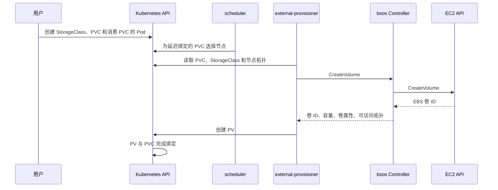

# 动态供应与 CreateVolume

- 代码仓库：https://github.com/normalzzz/bsos
- 信息来源：https://github.com/viveksinghggits
- 参考项目：https://github.com/viveksinghggits/bsos
- 来源与许可说明：https://github.com/normalzzz/bsos/blob/main/NOTICE.md

动态供应是指：用户通过 PVC 申请存储后，由 Kubernetes 和存储驱动创建符合要求的卷，无需管理员预先准备每个卷和 PV。

在本仓库中，external-provisioner 负责观察 PVC、调用 `bsos` 的 `CreateVolume`，并根据响应创建 PV。`bsos` 负责调用 AWS API 创建真正存储数据的 EBS 卷。PV/PVC 绑定后，Kubernetes 就知道这份存储申请对应哪个后端卷，但卷还没有附加或挂载到应用节点。external-provisioner 的职责说明：

https://kubernetes-csi.github.io/docs/external-provisioner.html

## Controller Pod 中的 provisioner

manifest/deployment.yaml 在同一个 Pod 中运行 `bsos`、external-provisioner 和 external-attacher。三个容器通过 `endpoint-volume` 共享 socket 目录：

https://github.com/normalzzz/bsos/blob/main/manifest/deployment.yaml

```yaml
volumes:
  - name: endpoint-volume
    emptyDir: {}
```

调用方都在 Pod 内，因此这里用 `emptyDir` 共享目录。节点端的 hostPath 配置见《节点插件注册与 CSINode》。

https://github.com/normalzzz/bsos/blob/main/doc/doc4.md

provisioner 的配置摘录如下，镜像地址见当前清单：

```yaml
name: external-provisioner
args:
  - "--csi-address=$(CSI_ENDPOINT)"
volumeMounts:
  - mountPath: /var/lib/csi/sockets/pluginproxy/
    name: endpoint-volume
env:
  - name: CSI_ENDPOINT
    value: /var/lib/csi/sockets/pluginproxy/bsoscsi.sock
```

`--csi-address` 指向 provisioner 容器中可访问的 socket。驱动的 `--endpoint` 则使用 `unix:///var/lib/csi/sockets/pluginproxy/bsoscsi.sock`，两者最终访问同一个文件。

清单中的 Deployment 为单副本，没有设置 `--leader-election`。如果增加副本，需要为 provisioner 开启 leader election（领导者选举），让多个 provisioner 中只有一个负责处理供应任务，其余实例等待接替。相关参数见 external-provisioner 文档。

https://github.com/kubernetes-csi/external-provisioner#command-line-options

Controller Pod 使用 `csi-provisioner` ServiceAccount。manifest/rbac.yaml 为它绑定了 provisioner 和 attacher 的权限。provisioner 需要观察 PVC、PV 和 StorageClass，创建 PV，记录事件，并读取拓扑涉及的 Node 和 CSINode。驱动自己也要在启动时读取 Node；AWS API 权限则由 IAM 身份提供。

https://github.com/normalzzz/bsos/blob/main/manifest/rbac.yaml

## StorageClass 和 PVC

仓库中的 examples/storageclass.yaml 定义了这个驱动的 StorageClass：

https://github.com/normalzzz/bsos/blob/main/examples/storageclass.yaml

```yaml
apiVersion: storage.k8s.io/v1
kind: StorageClass
metadata:
  name: bsos
provisioner: bsos.normalzzz.csi.dev
volumeBindingMode: WaitForFirstConsumer
```

这里有两个名称。`metadata.name: bsos` 是 StorageClass 的名称，供 PVC 选择；`provisioner: bsos.normalzzz.csi.dev` 是 CSI 驱动名称，必须与 `GetPluginInfo` 的响应一致。这个字段用来指定由哪个驱动创建卷，而 external-provisioner 是执行这项调用的程序。

EBS 卷只能附加到同一可用区的实例。`WaitForFirstConsumer` 因此把创建卷的时机推迟到有 Pod 使用 PVC 时：调度器先结合 Pod 的要求选出候选节点，provisioner 再根据节点所在的可用区发起创建卷请求。只创建 PVC、还没有使用它的 Pod 时，PVC 可以保持 Pending。StorageClass 绑定模式说明：

https://kubernetes.io/docs/concepts/storage/storage-classes/#volume-binding-mode

examples/pvc.yaml 申请一个 3 GiB 的卷：

https://github.com/normalzzz/bsos/blob/main/examples/pvc.yaml

```yaml
apiVersion: v1
kind: PersistentVolumeClaim
metadata:
  name: bsos-pvc
spec:
  storageClassName: bsos
  accessModes:
    - ReadWriteOnce
  resources:
    requests:
      storage: 3Gi
```

PVC 的 `storageClassName: bsos` 指向上面的 StorageClass。Pod 再通过 `claimName: bsos-pvc` 引用这个 PVC；Pod 和 PVC 必须位于同一个命名空间。这几个名称连起来，Kubernetes 才能从应用的用卷需求找到负责创建卷的驱动。

这个 PVC 没有设置 `volumeMode`，默认按文件系统卷处理，应用最终通过目录访问文件。`ReadWriteOnce` 表示卷允许由一个节点读写挂载，同一节点上的多个 Pod 仍可使用它。这里使用它配合当前的单节点文件系统挂载实现。PVC 访问模式说明：

https://kubernetes.io/docs/concepts/storage/persistent-volumes/#access-modes

## 从 PVC 到 EBS 卷



provisioner 把 PVC、StorageClass 和节点信息转换成 `CreateVolumeRequest`。用户不需要直接构造这个 gRPC 请求。对于上面的 PVC，几个主要字段的含义如下：

| 请求字段 | 驱动从中读取什么 | 本例中的含义 |
| --- | --- | --- |
| `Name` | 这次创建请求使用的卷名称 | provisioner 生成，用于识别重复请求；此时还没有 EBS 卷 ID |
| `CapacityRange.RequiredBytes` | 至少需要多少字节 | `3Gi` 转换为 `3221225472` 字节 |
| `VolumeCapabilities` | 卷以什么形式、什么访问模式使用 | 文件系统卷，访问模式对应 `SINGLE_NODE_WRITER` |
| `AccessibilityRequirements` | 卷需要在哪些节点位置可用 | 本仓库使用 `topology.kubernetes.io/zone` 表达可用区 |

下面按驱动处理请求的顺序，依次看参数检查、可用区选择和 AWS 调用。

## 请求检查和日志

实现位于 pkg/driver/ControllerServer.go。方法开始时先复制请求，去掉副本中的 Secrets，再序列化日志：

https://github.com/normalzzz/bsos/blob/main/pkg/driver/ControllerServer.go

```go
logRequest := proto.Clone(r).(*csi.CreateVolumeRequest)
logRequest.Secrets = nil

requestJSON, err := protojson.Marshal(logRequest)
```

这里的 `r` 是收到的 CSI 请求。`proto.Clone` 创建独立副本，`(*csi.CreateVolumeRequest)` 把副本作为创建卷请求使用，`protojson.Marshal` 再将它转成适合写入日志的 JSON。Secrets 用来传递凭据，所以代码在记录前移除了它。这只会改变日志副本，原始请求保持不变。其他请求字段没有额外脱敏。

`validateCreateVolumeRequest` 检查卷名称、访问能力是否为空，以及能力是否符合当前代码的条件。`isValidVolumeCapabilities` 接受 `SINGLE_NODE_WRITER`，也接受块设备类型的 `MULTI_NODE_MULTI_WRITER`。不过函数在循环的第一项就返回，尚未逐项验证整个能力列表；节点端也没有完整的裸块设备流程。当前示例使用 `ReadWriteOnce` 文件系统卷。

## 选择可用区

代码从请求的第一个 Requisite 拓扑中取可用区：

```go
topologies := r.GetAccessibilityRequirements().GetRequisite()
if len(topologies) == 0 {
    return nil, status.Error(codes.InvalidArgument, "volume availability zone is required")
}
zone := topologies[0].GetSegments()["topology.kubernetes.io/zone"]
if zone == "" {
    return nil, status.Error(codes.InvalidArgument, "topology is missing topology.kubernetes.io/zone")
}
```

这个键与 `NodeGetInfo` 返回的拓扑键一致。节点插件需要先注册，provisioner 才能从 CSINode 的拓扑键和 Node 的标签取得可用区信息。

`Requisite` 给出卷必须满足的拓扑要求。对于只能位于一个可用区的 EBS 卷，它表示可选择的可用区范围；`Preferred` 给出选择时的优先顺序。

例如，假设 `Requisite` 中依次有 zone-A、zone-B，而调度器选出的节点位于 zone-B。未开启 strict topology 时，provisioner 可以把两个区都放进 Requisite，并把 zone-B 放在 Preferred 的第一项。驱动应结合这两个列表选择位置。当前代码直接取 `Requisite[0]`，就可能在 zone-A 创建卷，与候选节点所在的区不一致。这里的 zone-A、zone-B 只是说明用的名称。provisioner 拓扑参数说明：

https://github.com/kubernetes-csi/external-provisioner#topology-support

使用当前实现测试时，可以在 external-provisioner 容器的 `args` 中添加 `--strict-topology`。配合 `WaitForFirstConsumer`，它会让 Requisite 与 Preferred 都限定为所选节点的拓扑。下面是建议的参数配置，当前仓库清单尚未添加这一项：

```yaml
args:
  - "--csi-address=$(CSI_ENDPOINT)"
  - "--strict-topology"
```

这个参数可以缩小测试时的选择范围，驱动仍需补齐对一般拓扑请求的处理。

## 容量换算

CSI 容量单位是 bytes，EC2 `CreateVolumeInput.Size` 使用 GiB。代码按 GiB 向上取整，保证实际容量不小于请求值：

```go
const gib int64 = 1024 * 1024 * 1024
sizeBytes := r.GetCapacityRange().GetRequiredBytes()
limitBytes := r.GetCapacityRange().GetLimitBytes()
if sizeBytes < 0 || limitBytes < 0 {
    return nil, status.Error(codes.InvalidArgument, "volume capacity must not be negative")
}
sizeGiB := sizeBytes / gib
if sizeBytes%gib != 0 {
    sizeGiB++
}
if sizeGiB == 0 {
    sizeGiB = 1
}
if sizeGiB > math.MaxInt32 || (limitBytes > 0 && sizeGiB > limitBytes/gib) {
    return nil, status.Error(codes.OutOfRange, "rounded volume size exceeds capacity limit")
}
```

3 GiB 对应 `3221225472` bytes，换算后仍为 3 GiB。若请求比 1 GiB 多一个字节，就需要创建 2 GiB 的 EBS 卷。`RequiredBytes` 是容量下限，`LimitBytes` 是容量上限，其中上限为 0 表示没有指定上限。如果向上取整后的容量超过非零上限，方法返回 `OutOfRange`，表示无法满足这个容量范围。没有给出所需容量时，当前实现至少分配 1 GiB。

这里还检查了向 `int32` 转换的范围，但没有完整检查 gp3 的后端容量限制，AWS API 仍可能拒绝请求。

## 调用 AWS 并返回卷信息

创建输入使用前面算出的容量和可用区，卷类型固定为 gp3：

```go
volumeInput := &ec2.CreateVolumeInput{
    AvailabilityZone: aws.String(zone),
    Size:             aws.Int32(int32(sizeGiB)),
    VolumeType:       types.VolumeTypeGp3,
}
```

gp3 是 AWS EBS 的一种通用 SSD 卷类型。`zone` 和 `sizeGiB` 来自前面的计算，`aws.String`、`aws.Int32` 将值转换为 AWS SDK 字段需要的指针形式。

当前代码没有读取 Parameters 来配置卷类型、IOPS 或加密设置。其他 EBS CSI 驱动使用的 StorageClass 参数，在这里还没有对应的处理。

AWS 调用为：

```go
createVolumeOutput, err := drv.Ec2client.CreateVolume(ctx, volumeInput)
```

成功后，响应把 EBS 卷 ID 写入 `VolumeId`，把实际容量写入 `CapacityBytes`，把可用区写入 `VolumeContext` 和 `AccessibleTopology`。

| CSI 响应字段 | PV 中的对应内容 |
| --- | --- |
| `VolumeId` | `spec.csi.volumeHandle` |
| `CapacityBytes` | `spec.capacity.storage` |
| `VolumeContext` | `spec.csi.volumeAttributes` |
| `AccessibleTopology` | 供应器据此生成 `spec.nodeAffinity` |

这里有两处可用区信息，但用途不同。`VolumeContext` 中的 `availabilityZone` 是驱动自定义的卷属性，Kubernetes 会保存并传给后续 CSI 请求；`AccessibleTopology` 表达卷在哪个位置可用，provisioner 据此为 PV 设置节点亲和性，限制使用该卷的 Pod 可以调度到哪些节点。仅在卷属性里写一个可用区，不会产生调度约束。

provisioner 根据这份响应创建 PV，Kubernetes 随后完成 PV/PVC 绑定。驱动此时只创建了后端卷，节点附加过程见《卷附加与 VolumeAttachment》。

https://github.com/normalzzz/bsos/blob/main/doc/doc6.md

## 重试与回收

provisioner 会对可重试的失败或超时请求再次调用 `CreateVolume`。例如，AWS 已经创建了卷，但响应没有及时传回 provisioner，provisioner 就无法判断这次创建是否成功。它会使用相同的 Name 重试，驱动此时应找到已创建的卷，检查容量等要求兼容后返回原来的卷 ID。

这种“重复处理同一个请求，仍得到同一个兼容结果”的行为称为幂等。CSI 要求 `CreateVolume` 支持它，避免一次 PVC 申请因为重试创建出多个卷。规范说明：

https://github.com/container-storage-interface/spec/blob/v1.13.0/spec.md#createvolume

当前实现只校验 Name 非空，没有把这个名称用于查找已创建的卷，也没有按 CSI 名称建立稳定的后端请求标识。重复 RPC 仍可能创建多个 EBS 卷，后续需要补充同名查找、参数兼容检查和并发处理。

当前 StorageClass 未设置 `reclaimPolicy`，动态供应的 PV 默认使用 Delete 策略，但驱动的 `DeleteVolume` 仍返回 `Unimplemented`。删除 PVC 后，回收流程不能靠当前代码自动完成。StorageClass 回收策略说明：

https://kubernetes.io/docs/concepts/storage/storage-classes/#reclaim-policy

## 查看供应结果

以下命令在仓库根目录执行，前提是 Controller 和节点插件已按前两篇部署并注册。doc5 到 doc8 都使用 `bsos-demo` 命名空间；如果之前已经创建过同一组资源，可以继续检查它们。

创建 StorageClass 和 PVC 后，再创建使用 PVC 的 Pod，才能触发当前的延迟供应：

```bash
kubectl create namespace bsos-demo --dry-run=client -o yaml | kubectl apply -f -
kubectl apply -f examples/storageclass.yaml
kubectl apply -n bsos-demo -f examples/pvc.yaml
kubectl apply -n bsos-demo -f examples/pod.yaml
kubectl describe pvc bsos-pvc -n bsos-demo
kubectl get pvc bsos-pvc -n bsos-demo
```

查看 Controller Pod 中的供应日志：

```bash
controller_pod=$(kubectl get pods -n kube-system -l app=bsos \
  -o jsonpath='{.items[0].metadata.name}')
kubectl logs -n kube-system "$controller_pod" -c external-provisioner
kubectl logs -n kube-system "$controller_pod" -c bsos
```

`kubectl get pvc` 的 STATUS 显示 Bound 后，表示 PVC 已绑定到一个 PV。此时在同一终端中取得实际 PV 名称并查看它；如果还是 Pending，先根据 describe 中的 Events 和 provisioner 日志排查，后面的 `pv_name` 会暂时取不到值。

```bash
pv_name=$(kubectl get pvc bsos-pvc -n bsos-demo -o jsonpath='{.spec.volumeName}')
kubectl get pv "$pv_name" -o yaml
```

核对 PV 的驱动名称、EBS 卷 ID、容量和节点亲和性，再对照驱动日志中的请求可用区。PVC 已经 Bound、Pod 仍未运行时，还要继续检查附加和节点挂载阶段。
