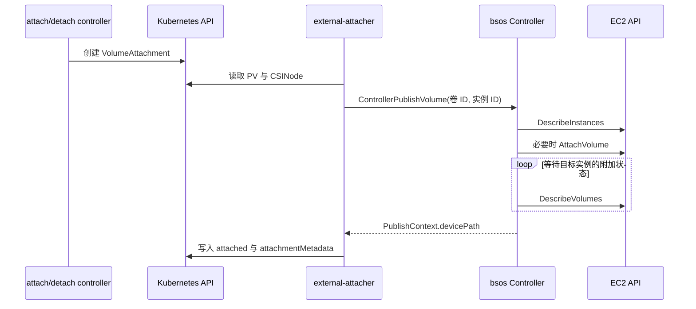

# 卷附加与 VolumeAttachment

- 代码仓库：https://github.com/normalzzz/bsos
- 信息来源：https://github.com/viveksinghggits
- 参考项目：https://github.com/viveksinghggits/bsos
- 来源与许可说明：https://github.com/normalzzz/bsos/blob/main/NOTICE.md

`CreateVolume` 创建 EBS 卷后，AWS 中已经有了这个卷，但应用节点还不能使用它。附加（attach）要解决的是：把这个卷连接到哪个 EC2 实例，让实例的操作系统能够发现对应的块设备。

Kubernetes 通过 `VolumeAttachment` 记录“哪个 PV 需要附加到哪个节点”。external-attacher 观察这个资源，调用驱动的 `ControllerPublishVolume`。在本仓库中，这个方法负责调用 EC2 的附加接口。external-attacher 的职责说明：

https://kubernetes-csi.github.io/docs/external-attacher.html

附加完成后，节点插件还需要找到正确的设备并挂载文件系统，应用才能通过目录使用卷。

## 谁创建 VolumeAttachment

对于需要附加的 CSI 驱动，Pod 调度到节点后，Kubernetes 的 attach/detach 控制器根据 Pod 使用的 PV 创建 `VolumeAttachment`。external-attacher 根据 `spec.attacher` 判断资源是否属于自己的驱动，在 CSI 调用完成后更新状态。它匹配的是这个字段中的驱动名称，不是 VolumeAttachment 的资源名称。

下面的片段用于阅读自动生成的资源，无需手动创建。资源名称、PV 名称和节点名称以实际集群为准：

```yaml
apiVersion: storage.k8s.io/v1
kind: VolumeAttachment
metadata:
  name: your-volumeattachment-name
spec:
  attacher: bsos.normalzzz.csi.dev
  nodeName: your-kubernetes-node-name
  source:
    persistentVolumeName: your-pv-name
```

这是集群级资源，不属于某个命名空间。`spec` 表达希望完成的操作：由 `spec.attacher` 指定的驱动，把 `spec.source` 指向的 PV 附加到 `spec.nodeName` 指定的 Kubernetes 节点。

`status` 记录处理结果。成功后，attacher 将 `status.attached` 设为 true，并把驱动返回的附加信息写入 `status.attachmentMetadata`；失败信息可以在 `status.attachError` 中查看。VolumeAttachment API 说明：

https://kubernetes.io/docs/reference/kubernetes-api/storage/volume-attachment-v1/

VolumeAttachment 记录 Kubernetes 的需求和处理状态，EC2 API 中的 attachment 记录 EBS 与实例的实际附加关系。

## 从节点名称到实例 ID

`VolumeAttachment` 使用 Kubernetes Node 名称，EC2 `AttachVolume` 需要实例 ID。external-attacher 读取对应 CSINode，在 `spec.drivers` 中找到 `bsos.normalzzz.csi.dev`，使用它的 `nodeID` 构造 CSI 请求。

这个值由 `NodeGetInfo` 返回，在本仓库中是从 Node 的 `spec.providerID` 提取的 EC2 实例 ID。于是，一个附加请求中的两个关键 ID 分别来自下面的位置：

| CSI 请求字段 | Kubernetes 中的来源 | AWS API 中的用途 |
| --- | --- | --- |
| `VolumeId` | PV 的 `spec.csi.volumeHandle` | 指定要附加的 EBS 卷 |
| `NodeId` | 对应 CSINode 的驱动条目中的 `nodeID` | 指定接收这个卷的 EC2 实例 |

例如，VolumeAttachment 中的节点名可以是 `worker-a`，而发送给 `bsos` 的 NodeId 是该节点对应的 `i-...` 实例 ID。两者标识同一台机器，但分别供 Kubernetes 和存储驱动使用。节点映射的建立过程见《节点插件注册与 CSINode》。

https://github.com/normalzzz/bsos/blob/main/doc/doc4.md



## Controller Pod 中的 attacher

manifest/deployment.yaml 将 attacher 与 `bsos` 放在同一个 Pod，使用与 provisioner 相同的共享 socket：

https://github.com/normalzzz/bsos/blob/main/manifest/deployment.yaml

```yaml
name: external-attacher
args:
  - "--csi-address=$(CSI_ENDPOINT)"
volumeMounts:
  - mountPath: /var/lib/csi/sockets/pluginproxy/
    name: endpoint-volume
env:
  - name: CSI_ENDPOINT
    value: /var/lib/csi/sockets/pluginproxy/bsoscsi.sock
```

Pod 使用 `csi-provisioner` ServiceAccount。manifest/rbac.yaml 除了供应权限，还为它绑定了 `external-attacher-runner`，允许读取 PV 和 CSINode，观察、修改 VolumeAttachment，以及修改 `volumeattachments/status`。

https://github.com/normalzzz/bsos/blob/main/manifest/rbac.yaml

驱动的 `ControllerGetCapabilities` 声明了 `PUBLISH_UNPUBLISH_VOLUME`，告知调用方支持控制端发布与解除发布。当前只完成了发布方向，`ControllerUnpublishVolume` 尚未实现。

## 检查请求和选择设备名

实现位于 pkg/driver/ControllerServer.go。方法先检查节点 ID 和卷 ID：

https://github.com/normalzzz/bsos/blob/main/pkg/driver/ControllerServer.go

```go
if r.GetNodeId() == "" || r.GetVolumeId() == "" {
    return nil, status.Error(codes.InvalidArgument, "node ID and volume ID are required")
}
```

之后获取 `attachMu` 锁，并查询请求指定的实例：

```go
drv.attachMu.Lock()
defer drv.attachMu.Unlock()
if ctx.Err() != nil {
    return nil, status.FromContextError(ctx.Err()).Err()
}

instances, err := drv.Ec2client.DescribeInstances(ctx, &ec2.DescribeInstancesInput{
    InstanceIds: []string{r.GetNodeId()},
})
```

同一个驱动进程中的附加请求会串行执行，减少同时选中相同设备名的情况。这把锁不跨进程，而且一直持有到等待附加结束，其他请求可能在等待锁时耗尽调用超时。

`selectAttachDevice` 检查 EC2 返回的 BlockDeviceMappings，即这个实例的卷与设备名对应关系。如果目标卷已经有映射，函数复用原来的设备名；如果它还处于 detaching（正在解除附加），就返回 `Aborted`，让本次请求先失败。没有现成映射时，从 `/dev/sdf` 到 `/dev/sdp` 中找一个尚未使用的名称。

```go
for letter := 'f'; letter <= 'p'; letter++ {
    if !used[string(letter)] {
        return "/dev/sd" + string(letter), false, nil
    }
}
return "", false, status.Error(codes.ResourceExhausted, "no free device name in /dev/sdf through /dev/sdp")
```

函数统计已用名称时，会把 `/dev/sdf`、`/dev/xvdf` 和带数字分区后缀的对应名称都归到字母 `f`，避免再次选择它。如果 `f` 到 `p` 都已占用，就返回 `ResourceExhausted`，表示当前实现没有可分配的设备名。这个搜索范围是代码自己的限制，不等于 EC2 实例完整的 EBS 附加容量。

## 附加卷并等待状态

没有已有映射时，代码调用 EC2 `AttachVolume`：

```go
volumeAttachInput := &ec2.AttachVolumeInput{
    Device:     aws.String(device),
    InstanceId: aws.String(r.GetNodeId()),
    VolumeId:   aws.String(r.GetVolumeId()),
}
```

`Device` 是提交给 EC2 的设备名，`InstanceId` 和 `VolumeId` 指定实例与卷。复用已有映射时，代码跳过这次 AttachVolume 调用，继续检查状态。

AWS 接受附加请求后，卷可能还在 attaching（正在附加），因此方法不能在 `AttachVolume` 返回后立即报告成功。驱动通过 `wait.PollUntilContextTimeout` 每秒查询一次，代码中的最长等待时间是五分钟。成功条件是返回的 attachment 属于请求指定的实例，并且状态为 attached：

```go
if aws.ToString(attachment.InstanceId) == r.GetNodeId() && attachment.State == types.VolumeAttachmentStateAttached {
    return true, nil
}
```

这里的等待还受 `ctx` 的截止时间限制。`ctx` 是 Go 的 `context.Context`，用来传递调用取消和超时信号；它与后面保存设备信息的 `PublishContext` 是不同的东西。

当前 attacher 清单没有设置 `--timeout`，官方文档给出的默认 RPC 超时是 15 秒。因此这次调用可能先达到 15 秒的期限，无法等满代码中的五分钟。部署时要结合实际附加耗时配置这个参数。attacher 超时配置说明：

https://github.com/kubernetes-csi/external-attacher#command-line-options

RPC 超时也不代表 AWS 已经停止附加。attacher 重试时，驱动可能发现卷已经附加成功，此时应返回已有结果。复用设备映射能处理其中一部分重复请求；当前实现还没有完整验证卷能力、只读要求和已有附加关系是否与请求兼容，幂等处理仍需补齐。

## PublishContext 怎样传到节点

附加成功后，代码返回设备名：

```go
pvInfo := map[string]string{DevicePathKey: device}
return &csi.ControllerPublishVolumeResponse{PublishContext: pvInfo}, nil
```

`DevicePathKey` 在 pkg/driver/Driver.go 中定义为 `devicePath`。attacher 把这份 PublishContext 保存到 VolumeAttachment 的 `status.attachmentMetadata`，kubelet 再把它传入节点的 `NodeStageVolume` 和 `NodePublishVolume` 请求。

https://github.com/normalzzz/bsos/blob/main/pkg/driver/Driver.go

例如，这次分配的设备名如果是 `/dev/sdf`，VolumeAttachment 的状态片段会是下面的形式。它是字段示意，不是本教程的实测输出：

```yaml
status:
  attached: true
  attachmentMetadata:
    devicePath: /dev/sdf
```

`PublishContext` 是驱动自定义的字符串键值表。在这里，它告诉节点插件本次附加使用了哪个设备名。`VolumeContext` 则来自更早的 `CreateVolume`，保存在 PV 中，描述卷自身的属性。两者都由 Kubernetes 保存并转交，Controller 不会直接向节点插件发送挂载请求。

`NodeStageVolume` 如何使用 `devicePath`，见《节点上的文件系统与挂载》。

https://github.com/normalzzz/bsos/blob/main/doc/doc7.md

## EC2 设备名和节点设备路径

当前代码直接把提交给 EC2 的 `/dev/sd*` 名称作为 `devicePath` 返回。但宿主机上的实际名称可能不同：部分环境使用 `/dev/xvd*`，Nitro 实例上的 EBS 设备通常表现为 `/dev/nvme*n1`。NVMe 设备的枚举顺序也不能直接当作卷身份。EBS NVMe 设备说明：

https://docs.aws.amazon.com/ebs/latest/userguide/identify-nvme-ebs-device.html

看到 `status.attached: true` 后，还要确认节点上能访问返回的设备路径。节点端需要根据 EBS 卷 ID 识别实际设备，等待设备出现后再处理文件系统。当前仓库尚未实现这层解析，测试时要核对返回路径与节点设备是否对应。

## 查看附加结果

沿用 doc5 的 `bsos-demo` 命名空间。先确认 PVC 已显示 Bound，再取得 PV 名称并列出附加资源。PV 和 VolumeAttachment 都是集群级资源，查询它们时不需要指定命名空间。

```bash
pv_name=$(kubectl get pvc bsos-pvc -n bsos-demo -o jsonpath='{.spec.volumeName}')
printf 'PV=%s\n' "$pv_name"
kubectl get volumeattachments \
  -o custom-columns='NAME:.metadata.name,DRIVER:.spec.attacher,PV:.spec.source.persistentVolumeName,NODE:.spec.nodeName,ATTACHED:.status.attached'
```

找到 `PV` 列与刚才输出相同的条目，把其 NAME 列填入下面的 `attachment_name`，再在同一终端中查看详情：

```bash
attachment_name=your-volumeattachment-name
kubectl get volumeattachment "$attachment_name" -o yaml
kubectl describe volumeattachment "$attachment_name"
controller_pod=$(kubectl get pods -n kube-system -l app=bsos \
  -o jsonpath='{.items[0].metadata.name}')
kubectl logs -n kube-system "$controller_pod" -c external-attacher
kubectl logs -n kube-system "$controller_pod" -c bsos
```

核对 `spec.nodeName`、CSINode 的 `nodeID` 和 EC2 实例 ID，再看 `status.attached`、`status.attachError` 及返回的 `devicePath`。没有 VolumeAttachment 时，先检查 PVC 是否绑定、Pod 是否已经调度，以及驱动是否要求附加。

Pod 停止使用卷后，正常流程还需要解除节点挂载和控制端附加。当前 `ControllerUnpublishVolume` 返回 `Unimplemented`，不能把删除 Pod 或 VolumeAttachment 当作已经完成 EBS detach。
