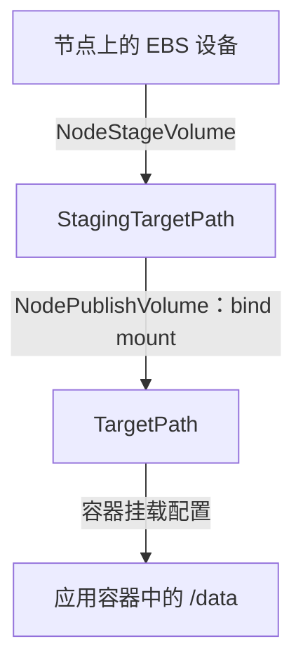

# 节点上的文件系统与挂载

- 代码仓库：https://github.com/normalzzz/bsos
- 信息来源：https://github.com/viveksinghggits
- 参考项目：https://github.com/viveksinghggits/bsos
- 来源与许可说明：https://github.com/normalzzz/bsos/blob/main/NOTICE.md

EBS 卷附加到 EC2 实例后，节点操作系统可以发现一个块设备，例如 `/dev/sdf`。块设备提供按块读写数据的能力，应用却通常希望通过 `/data/hello.txt` 这样的文件路径读写。中间还需要文件系统和挂载操作。

文件系统负责组织目录、文件名和文件内容。格式化是在设备上建立文件系统；挂载是把已有文件系统接到某个目录，让程序能够通过这个目录访问文件。已有文件系统的卷再次使用时，应直接挂载并保留数据。

在本仓库的文件系统卷流程中，kubelet 先调用 `NodeStageVolume`，由驱动检查文件系统，必要时格式化，再挂载到节点暂存目录。随后调用 `NodePublishVolume`，把暂存目录中的文件系统提供给具体的 Pod。

两个方法都在 pkg/driver/NodeServer.go 中。它们使用 kubelet 传入的宿主机路径，应用容器里的 `/data` 则由 Pod 清单指定。

https://github.com/normalzzz/bsos/blob/main/pkg/driver/NodeServer.go

## NodeGetCapabilities

驱动通过 `NodeGetCapabilities` 声明节点端支持 `STAGE_UNSTAGE_VOLUME`：

```go
return &csi.NodeGetCapabilitiesResponse{
    Capabilities: []*csi.NodeServiceCapability{
        {
            Type: &csi.NodeServiceCapability_Rpc{
                Rpc: &csi.NodeServiceCapability_RPC{
                    Type: csi.NodeServiceCapability_RPC_STAGE_UNSTAGE_VOLUME,
                },
            },
        },
    },
}, nil
```

kubelet 读到这个能力后，会在 `NodePublishVolume` 之前调用 `NodeStageVolume`。Stage 为整台节点准备这个卷，Publish 为使用它的每个 Pod 准备路径；同一节点上多个 Pod 使用同一个卷时，可以复用 Stage 的结果。

“暂存目录”是 staging path 的译法，指卷在节点上统一挂载的位置。文件仍然保存在 EBS 卷中。这个目录不是把数据临时复制到节点磁盘的地方。

清理时，kubelet 先通过 `NodeUnpublishVolume` 解除各个 Pod 的挂载，卷不再被该节点上的 Pod 使用后，再通过 `NodeUnstageVolume` 解除暂存挂载。这组能力同时包含 Stage 和 Unstage；当前代码只实现了前一个方向。CSI Node Service 规范：

https://github.com/container-storage-interface/spec/blob/v1.13.0/spec.md#node-service-rpc

## 挂载路径

| 路径 | 谁提供 | 当前用途 |
| --- | --- | --- |
| `PublishContext["devicePath"]` | ControllerPublishVolume 的响应 | 当前驱动用来查找设备 |
| `StagingTargetPath` | kubelet | 节点上的暂存挂载目录 |
| `TargetPath` | kubelet | Pod 对应的节点侧卷目录 |
| `/data` | Pod 的 `volumeMounts.mountPath` | 应用容器内访问卷的目录 |

这四个路径处在不同的位置。设备路径指向块设备；`StagingTargetPath` 是节点上这个卷的公共挂载点；`TargetPath` 是节点上为某个 Pod 准备的挂载点。后两个目录都由 kubelet 选定并通过请求传入，驱动读取后执行挂载，无需自己猜测目录名。

`/data` 则是应用容器中的路径，由 Pod 清单指定。`TargetPath` 准备好后，容器运行时按 kubelet 的配置把卷挂入容器，所以应用读写 `/data/hello.txt` 时，最终访问的是这块 EBS 卷里的文件。



设备路径需要能对应到正确的 EBS 卷。当前 Controller 返回 EC2 的附加设备名，尚未解析节点上的 NVMe 路径，相关限制见《卷附加与 VolumeAttachment》。

https://github.com/normalzzz/bsos/blob/main/doc/doc6.md

## NodeStageVolume 的请求检查

方法先检查卷 ID、暂存路径和访问能力是否存在：

```go
if r.GetVolumeId() == "" {
    return nil, status.Error(codes.InvalidArgument, "Volume ID is required")
}
if r.GetStagingTargetPath() == "" {
    return nil, status.Error(codes.InvalidArgument, "Staging target path is required")
}
if r.GetVolumeCapability() == nil {
    return nil, status.Error(codes.InvalidArgument, "Volume capability is required")
}
```

CSI 用 Mount 和 Block 区分两种使用方式：Mount 把文件系统提供给应用，Block 把裸块设备提供给应用。当前 Stage 遇到 Block 类型就直接返回成功，没有准备设备路径；后面的 NodePublishVolume 又按文件系统卷访问 Mount 字段。因此，返回成功不能说明这个驱动已经支持 `volumeMode: Block`。仓库示例使用的是文件系统卷。

文件系统分支从 PublishContext 取得设备路径：

```go
sourcepath := r.GetPublishContext()[DevicePathKey]
targetpath := r.GetStagingTargetPath()
```

代码通过 `ls -l` 检查设备路径是否存在，暂存目录不存在时使用 `mkdir -p` 创建。它没有等待设备出现的重试，也没有校验该路径确实指向请求指定的 EBS 卷；附加完成与设备在系统中可见之间仍可能有时间差。

## 探测文件系统

挂载前，代码使用镜像里的 `blkid` 直接探测设备：

```go
output, err := exec.CommandContext(ctx, "blkid", "-p", "-o", "export", sourcepath).CombinedOutput()
if ctx.Err() != nil {
    return nil, status.FromContextError(ctx.Err()).Err()
}
fsType := ""
```

`-p` 直接探测设备上的标识，`-o export` 让结果按 `KEY=value` 输出。例如，已有 ext4 文件系统的设备可以包含下面这一行：

```text
TYPE=ext4
```

代码读取 `TYPE` 的值作为后续挂载的文件系统类型。`PTTYPE` 则表示检测到了分区表：这种设备可能包含多个分区，需要先确定应使用哪个分区。当前实现不处理分区，因此遇到它会返回错误。

探测失败时，只有退出码为 2 且输出为空，当前实现才会尝试格式化，其他情况返回错误。`blkid` 的退出码 2 也包含无法识别或无法取得设备内容信息的情况。格式化前仍需确认设备身份和探测环境，不能只靠这个退出码判断设备没有数据。blkid 退出状态的说明：

https://man7.org/linux/man-pages/man8/blkid.8.html#EXIT_STATUS

Dockerfile 安装了 `util-linux` 和 `e2fsprogs`，提供这里使用的设备探测、挂载和 ext4 格式化工具。部署自己的镜像时，这些命令需要在驱动容器中可用。

https://github.com/normalzzz/bsos/blob/main/Dockerfile

## 新卷格式化后的问题

当前格式化分支调用 `mkfs.ext4`，成功后继续执行 `drv.mount(sourcepath, targetpath, fsType, nil)`。但这个分支没有把 `fsType` 从空字符串改成 `ext4`。

`mount` 函数开头有下面的检查：

```go
if fsType == "" {
    return fmt.Errorf("fstype is not provided")
}
```

这就形成了一个具体问题：磁盘上已经建立了 ext4 文件系统，但代码中的 `fsType` 变量仍为空，挂载函数因此拒绝执行。所以新卷首次格式化成功后，这次 Stage 调用仍会报错。下一次调用可能从 `blkid` 读到 ext4 类型，但驱动应该在本次调用中设好类型。

格式化成功后需要补上下面这行，当前仓库还没有添加：

```go
fsType = "ext4"
```

完整处理还要核对请求的文件系统类型。当前新设备固定格式化成 ext4，已有设备使用探测到的类型，尚未统一验证它们与请求是否兼容。测试时先按当前示例使用 ext4 文件系统卷。

## 挂到暂存目录

`drv.mount` 创建目标目录，然后拼出 mount 参数：

```go
mountArgs = append(mountArgs, "-t", fsType)

if len(options) > 0 {
    mountArgs = append(mountArgs, "-o", strings.Join(options, ","))
}

mountArgs = append(mountArgs, source)
mountArgs = append(mountArgs, target)
```

Stage 调用传入的 options 是 nil，因此这里相当于执行 `mount -t 文件系统类型 设备路径 暂存目录`。请求中的 `MountFlags` 用于指定额外挂载选项，当前 Stage 没有把它们传给挂载函数。

当前方法也没有检查暂存目录是否已经挂载了这个卷。CSI 调用可能因为超时或连接中断而重试，即使上次挂载其实已经完成。因此，驱动需要先检查已有挂载：已经正确挂载就成功返回，被其他设备占用就报告错误。这样才能让重复请求得到一致的结果。

## NodePublishVolume 的 bind mount

Publish 使用暂存目录作为源，把它 bind mount 到 kubelet 给定的目标路径。当前方法按请求添加 bind 和只读选项：

```go
options := []string{"bind"}
if r.Readonly {
    options = append(options, "ro")
}
```

文件系统类型默认设为 ext4，请求的 Mount 中有类型时使用请求值。源路径和目标路径如下：

```go
source := r.StagingTargetPath
target := r.TargetPath
```

之后调用相同的挂载函数：

```go
err := drv.mount(source, target, fsType, options)
```

bind mount 是把一个已有目录的内容同时提供在另一个路径下。这里的 TargetPath 和 StagingTargetPath 访问的是同一份文件，操作不会复制整块卷的数据。

`Readonly` 指定这个 Pod 对应的挂载是否只读。即使目标挂载已经设为只读，其他可写挂载点仍可能写入同一文件系统。验证只读效果时，要检查 TargetPath 对应的挂载选项。mount 的 bind 语义说明：

https://man7.org/linux/man-pages/man8/mount.8.html#Bind_mount_operation

当前 Publish 方法没有完整检查卷 ID、访问能力和路径，也没有处理已有目标挂载。访问 `r.VolumeCapability.GetMount().FsType` 前还需要确认这是 Mount 类型，否则 Block 或缺失能力的请求可能触发空指针访问。节点端的能力校验需要与创建卷时的校验一致。

## 宿主机挂载配置

manifest/node-plugin.yaml 把宿主机的 `/dev` 和 `/var/lib/kubelet` 挂入驱动容器。驱动以 privileged 模式运行，kubelet 目录配置为双向挂载传播：

https://github.com/normalzzz/bsos/blob/main/manifest/node-plugin.yaml

```yaml
securityContext:
  privileged: true
volumeMounts:
  - name: pods-vol-dir
    mountPath: /var/lib/kubelet
    mountPropagation: "Bidirectional"
  - name: device-dir
    mountPath: /dev
  - name: plugin-dir
    mountPath: /csi
```

`/dev` 的目录挂载让驱动容器可以找到宿主机设备，privileged 模式使当前实现能够执行所需的设备和挂载操作。`/var/lib/kubelet` 则让驱动操作 kubelet 使用的目录。

共享目录还不够，因为“看见目录中的文件”和“看见另一个环境中新建立的挂载”是两件事。`mountPropagation: Bidirectional` 用来传播挂载变化，让驱动容器在这个目录下执行的挂载也能在宿主机上生效，kubelet 才能继续把卷交给应用容器。CSI 节点部署说明：

https://kubernetes-csi.github.io/docs/deploying.html

## 卸载与解除附加

文件系统卷停止使用后，对应的清理顺序是：

```text
NodeUnpublishVolume       移除 Pod 对应 TargetPath 的挂载
NodeUnstageVolume         节点不再使用该卷时，移除 StagingTargetPath 的挂载
ControllerUnpublishVolume 解除卷与实例的附加关系
DeleteVolume              回收策略要求删除时，删除后端卷
```

当前仓库中这四个方法都返回 `Unimplemented`。声明了 `STAGE_UNSTAGE_VOLUME` 就需要实现 Unstage；控制端声明的创建/删除、发布/解除发布能力也需要补齐对应的清理操作。

卸载会解除目录与文件系统的连接，卷中的文件仍然保留；detach 会解除 EBS 卷与 EC2 实例的连接；DeleteVolume 才会删除后端卷。编写清理方法时，需要先确认当前处于哪一层。

卸载方法也要能处理重复请求：路径已解除挂载时成功返回，仍被使用、无法卸载时报告错误。移除挂载目录应放在解除挂载之后。控制端 detach 要在节点不再使用卷后执行，删除后端卷还要遵守 PV 的回收策略。

当前代码尚未完成这条清理路径，因此删除 Pod 不足以证明节点挂载和 EBS 附加关系已经移除。演示中的检查方法见《测试步骤与结果记录》。

https://github.com/normalzzz/bsos/blob/main/doc/doc8.md

## 查看节点日志和挂载

沿用前两篇的 `bsos-demo` 命名空间。应用 Pod 已被调度后，`spec.nodeName` 才有值；如果还没有节点名，应先查看 Pod 事件中的调度错误，再检查节点挂载。

取得应用所在节点，再找到同一节点上的驱动 Pod。下面的变量和命令在同一个终端执行：

```bash
node_name=$(kubectl get pod bsos-demo -n bsos-demo -o jsonpath='{.spec.nodeName}')
node_pod=$(kubectl get pods -n kube-system -l name=node-plugin \
  --field-selector "spec.nodeName=$node_name" \
  -o jsonpath='{.items[0].metadata.name}')
kubectl logs -n kube-system "$node_pod" -c node-plugin
kubectl describe pod bsos-demo -n bsos-demo
```

在节点驱动容器中查看设备与挂载信息：

```bash
kubectl exec -n kube-system "$node_pod" -c node-plugin -- \
  lsblk -o NAME,PATH,SIZE,FSTYPE,MOUNTPOINTS,SERIAL
kubectl exec -n kube-system "$node_pod" -c node-plugin -- \
  findmnt -o TARGET,SOURCE,FSTYPE,OPTIONS
```

`lsblk` 用来查看设备、文件系统类型和设备上的挂载点；`findmnt` 用来查看已经存在的挂载，其中 TARGET 是挂载位置，SOURCE 是数据来源，FSTYPE 是文件系统类型，OPTIONS 是挂载选项。

Stage 日志会记录 source 和 target，可以在挂载表中查找对应关系。`Node NodePublishVolume is called` 只表示进入了方法，仍需查看后续错误、Pod 事件和目标挂载。确认暂存目录和 Pod 目标目录都挂载了同一个卷后，再到应用容器中检查 `/data`。
